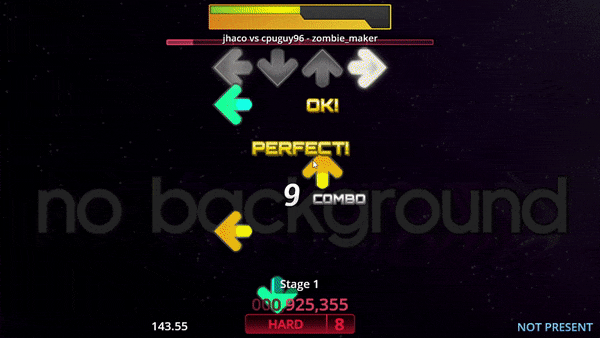

<div align="center">

# StepCOVNet



**Audio to StepMania Note Generator using Deep Learning**

[](https://github.com/cpuguy96/StepCOVNet/actions/workflows/pre-submit.yml)
[](https://app.codacy.com/gh/cpuguy96/StepCOVNet/dashboard?utm_source=gh&utm_medium=referral&utm_content=&utm_campaign=Badge_coverage)
[](https://app.codacy.com/gh/cpuguy96/StepCOVNet/dashboard?utm_source=gh&utm_medium=referral&utm_content=&utm_campaign=Badge_grade)
[](https://www.python.org/downloads/)
[](LICENSE)

</div>

---

## 📖 About

**StepCOVNet** is a deep learning project designed to automatically generate StepMania charts from audio files. It
utilizes Convolutional Neural Networks (CNNs) and Transformers to detect note onsets and predict arrow patterns,
allowing rhythm game enthusiasts to create charts for their favorite songs instantly.

## 📑 Table of Contents

- [Installation](#-installation)
- [Usage](#-usage)
  - [Generating Charts](#generating-charts)
  - [Training Models](#training-models)
    - [Data Preparation](#data-preparation)
    - [Training Onset Model](#training-onset-model)
    - [Training Arrow Model](#training-arrow-model)
- [Project Structure](#-project-structure)
- [Contributing](#-contributing)
- [Credits](#-credits)
- [License](#-license)

## 💻 Installation

1. **Clone the repository**

   ```bash
   git clone https://github.com/cpuguy96/StepCOVNet.git
   cd StepCOVNet
   ```

2. **Set up a virtual environment (Recommended)**

   ```bash
   python -m venv venv
   source venv/bin/activate  # On Windows use `venv\Scripts\activate`
   ```

3. **Install dependencies**
   ```bash
   pip install .
   # For GPU support
   pip install .[gpu]
   # For development dependencies
   pip install .[dev]
   # For development and GPU support
   pip install .[gpu-dev]
   ```

## 🚀 Usage

### Generating Charts

Generate a StepMania chart (`.txt` format) from an audio file using pre-trained models. If you do not have onset or arrow models yet, omit their paths and they will be downloaded automatically from Google Drive and cached locally.

> **Note**: The output is currently a `.txt` file. Use [`SMDataTools`](https://github.com/jhaco/SMDataTools) to convert
> it to a `.sm` file.

```bash
python scripts/generate.py \
  --audio_path "path/to/song.mp3" \
  --song_title "My Song" \
  --onset_model_path "models/onset.keras" \
  --arrow_model_path "models/arrow.keras" \
  --output_file "output/chart.txt"
```

| Argument                | Description                                                                        |
| :---------------------- | :--------------------------------------------------------------------------------- |
| `--audio_path`          | Path to the input audio file (`.mp3`, `.wav`, etc.)                                |
| `--song_title`          | Title of the song                                                                  |
| `--bpm`                 | Beats per minute (optional; estimated from audio when omitted)                     |
| `--onset_model_path`    | Path to the onset detection model (`.keras`); optional—omit to download and cache  |
| `--arrow_model_path`    | Path to the arrow prediction model (`.keras`); optional—omit to download and cache |
| `--output_file`         | Path where the generated chart text file will be saved                             |
| `--use_post_processing` | Refine onset timings with peak-picking (recommended for cleaner charts)            |

#### Generator UI

A simple desktop UI is available to run the generator without the command line: select an input audio file, optionally choose onset and arrow models (`.keras`)—or leave those fields blank to have default models downloaded from Google Drive and cached—enter the song title and optionally BPM (leave BPM blank to detect it from the audio), pick an output path, and run. Launch it with:

```bash
python scripts/generate_ui.py
```

Onset and arrow model paths are optional; leave them blank to use auto-downloaded default models (same behavior as the CLI). The UI uses the project venv when run from the repo.

**Download**: A pre-built Windows executable is available: [generate_ui.zip (Google Drive)](https://drive.google.com/file/d/1BmvUCW4fvW8ERkW7_AseaDYq5AhKEF6e/view?usp=drive_link). Extract and run; leave the onset/arrow model fields blank to have default models downloaded automatically.

#### Building the standalone app

You can build a single executable (e.g. `generate_ui.exe` on Windows) so others can run the Generator UI without installing Python or stepcovnet:

1. Install the project (editable or from wheel) and the build optional dependency:
   ```bash
   pip install -e .
   pip install .[build]
   ```
2. From the **project root**, run PyInstaller with the provided spec:
   ```bash
   pyinstaller scripts/generate_ui.spec
   ```
   Or run the helper script (from project root or anywhere):
   ```bash
   python scripts/build_generate_ui_binary.py
   ```
3. The executable will be created under `dist/` (e.g. `dist/generate_ui.exe`). The bundle includes TensorFlow/Keras, so the file is large and startup may take a few seconds.

### Training Models

Train your own models using the provided scripts.

#### Data Preparation

**Link to training data**:
[Google Drive](https://drive.google.com/file/d/1YszVRR82hH3nRpp5zAeLrApjiWSxtxvD/view?usp=drive_link)

1. **Parse `.sm` files**: Use [`SMDataTools`](https://github.com/jhaco/SMDataTools) to convert `.sm` files into `.txt`
   files (training data above already converted `.sm` to `.txt`).
2. **Organize files**: Ensure audio files (`.mp3`, `.ogg`, `.wav`) and their corresponding `.txt` chart files (same
   filename stem) are in the same directory.

#### Training Onset Model

Train the model responsible for detecting when a note should occur. Spectrogram
normalization is always applied so that training matches the inference pipeline.

```bash
python scripts/train_onset.py \
  --train_data_dir "data/train" \
  --val_data_dir "data/val" \
  --model_output_dir "models/onset" \
  --epochs 20
```

| Argument              | Description                              | Default        |
| :-------------------- | :--------------------------------------- | :------------- |
| `--train_data_dir`    | Directory containing training data       | Required       |
| `--val_data_dir`      | Directory containing validation data     | Required       |
| `--model_output_dir`  | Directory to save the trained model      | Required       |
| `--epochs`            | Number of training epochs                | `10`           |
| `--callback_root_dir` | Root directory for logs and checkpoints  | `""`           |
| `--take_count`        | Number of batches to use (for debugging) | `1`            |
| `--model_name`        | Custom name for the model                | Auto-generated |

#### Training Arrow Model

Train the model responsible for predicting the arrow pattern (Left, Down, Up, Right) for a given onset.

```bash
python scripts/train_arrow.py \
  --train_data_dir "data/train" \
  --val_data_dir "data/val" \
  --model_output_dir "models/arrow" \
  --epochs 20
```

| Argument              | Description                              | Default        |
| :-------------------- | :--------------------------------------- | :------------- |
| `--train_data_dir`    | Directory containing training data       | Required       |
| `--val_data_dir`      | Directory containing validation data     | Required       |
| `--model_output_dir`  | Directory to save the trained model      | Required       |
| `--epochs`            | Number of training epochs                | `10`           |
| `--callback_root_dir` | Root directory for logs and checkpoints  | `""`           |
| `--take_count`        | Number of batches to use (for debugging) | `1`            |
| `--model_name`        | Custom name for the model                | Auto-generated |

## 📂 Project Structure

```text
stepcovnet/
├── scripts/            # Training and generation scripts
│   ├── generate.py
│   ├── train_onset.py
│   └── train_arrow.py
├── src/
│   └── stepcovnet/     # Core package source code
│       ├── datasets.py # Data loading and preprocessing
│       ├── models.py   # Model architectures (U-Net, Transformer)
│       ├── trainers.py # Training loops
│       └── ...
├── tests/              # Unit tests
├── pyproject.toml      # Project configuration and dependencies
└── README.md           # Project documentation
```

## 🤝 Contributing

Contributions are welcome! Please follow these steps:

1. Fork the repository.
2. Create a new branch (`git checkout -b feature/YourFeature`).
3. Commit your changes (`git commit -m 'Add some feature'`).
4. Push to the branch (`git push origin feature/YourFeature`).
5. Open a Pull Request.

Please ensure your code passes existing tests and linting standards.

Before opening a PR, run the same checks as CI from **repository root**:

```bash
# Quick (ruff only, ~seconds):
python pre_submit.py --fast

# Full CI mirror before push (~30+ min):
python pre_submit.py --skip-install
```

On Windows with a project venv: `venv\Scripts\python.exe pre_submit.py --fast`

Optional: `pre-commit install --install-hooks --hook-type pre-commit` runs ruff on commit only (no full test suite on push).

**WSL GPU setup** (any clone): `bash scripts/wsl_ensure_env.sh` then `source scripts/wsl_gpu_env.sh` — see `scripts/wsl_*.sh`.

## 🌟 Credits

- **Inspiration**: [Dance Dance Convolution](https://arxiv.org/pdf/1703.06891.pdf)
- **Base Code**: Derived from [musical-onset-efficient](https://github.com/ronggong/musical-onset-efficient)
- **Collaboration**: Special thanks to [Jhaco](https://github.com/jhaco) for support and collaboration.

## 📄 License

This project is licensed under the Apache 2.0 License - see the [LICENSE](LICENSE) file for details.
