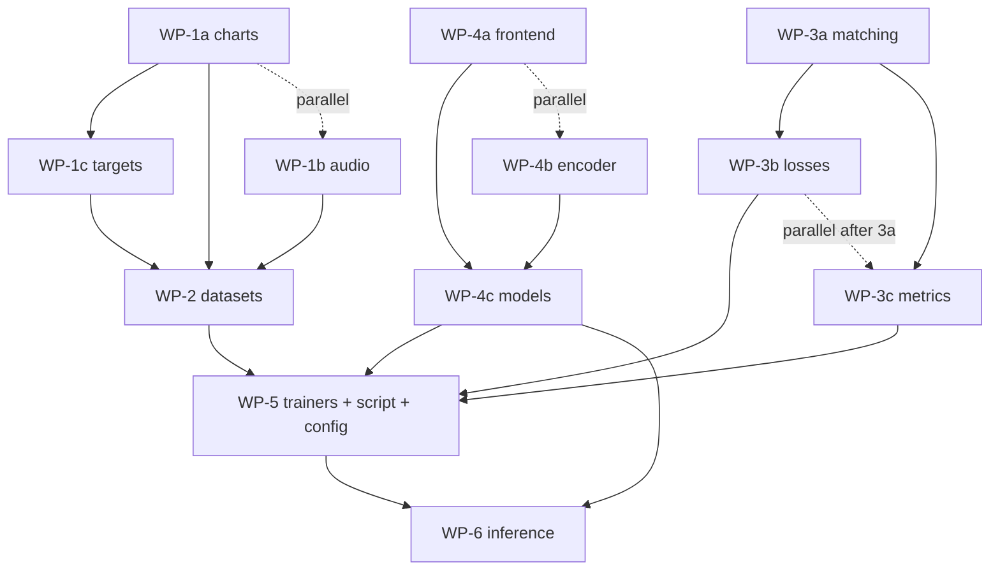

# Event-based onset detection — implementation plan

> **Historical:** Phases 1–6 were implemented in `src/stepcovnet/onset_events/`. For current architecture, training procedures, and next steps, use [PIPELINE_ARCHITECTURE.md](research/PIPELINE_ARCHITECTURE.md) and [EXPERIMENT_LOG.md](research/EXPERIMENT_LOG.md) § Current phase. This file is kept for WP/phase detail only.

**Status:** Superseded for routing — see note above.

**Last updated:** 2026-06-22 (banner only; body reflects 2026-06-01 handoff)

**Repo:** `stepcovnet` · **Package:** `src/stepcovnet/onset_events/`

---

## Handoff prompt (paste into monitor agent)

```text
You are the MONITOR agent for StepCOVNet event-based onset detection (v1).

Read docs/onset_events_plan.md in this order:
1) Handoff prompt (this block) + Invariants + Work packages + Phase tracker
2) Locked decisions (pre-build)
3) Design sections only if you need detail

Your job:
- Assign ONE work package (WP-ID) per sub-agent; never overlap "Owns" files.
- After each WP: run its Verification command (Windows venv for pytest).
- Update the Phase tracker table in the doc.
- Enforce: raw audio in; times+confidence out; K=1024; 44100 Hz; 300s truncate;
  skip charts >1024 steps; Hungarian matching; no HOP_COEFF in onset_events/;
  do not modify dense onset path.
- Phase 7 (generator) is OUT OF SCOPE.

Suggested waves:
  Wave 1 (parallel): WP-1a, WP-1b, WP-3a, WP-4a, WP-4b
  Wave 2: WP-1c, then WP-2
  Wave 3 (parallel): WP-3b, WP-3c
  Wave 4: WP-4c
  Wave 5: WP-5 (WSL GPU overfit one song from data/v2)
  Wave 6: WP-6

Data: data/v2/train, data/v2/val, data/v2/test (repo-relative).
Unit tests may use tests/testdata; training smoke uses data/v2 only.

Start by marking WP-1a and WP-1b in_progress and dispatching sub-agents.
```

---

## Table of contents

1. [Multi-agent execution](#multi-agent-execution-read-this-first-in-a-new-session)
2. [Locked decisions](#locked-decisions-pre-build)
3. [Summary & problem statement](#summary)
4. [I/O contract & architecture](#io-contract)
5. [Repository layout & modules](#repository-layout)
6. [Training batch, model, loss](#training-batch-schema)
7. [Config & commands](#config-file-sketch)
8. [Phases & testing](#implementation-phases)
9. [Sample rate (GPU probe)](#sample-rate-target_sample_rate)
10. [Deferred / tune later](#deferred--tune-later)
11. [Approval & revision log](#approval-checklist)

---

## Multi-agent execution (read this first in a new session)

This section is for **orchestrator / monitor agents** and **sub-agents**. The rest of the doc is design reference; this section is **how to split work without conflicts**.

### Roles

| Role | Responsibility |
|------|----------------|
| **Monitor (parent)** | Assign work packages, enforce [Locked decisions](#locked-decisions-pre-build), run verification commands, merge sub-agent output, update [Phase tracker](#phase-tracker). **Does not** parallelize conflicting file edits. |
| **Sub-agent** | One [work package](#work-packages) at a time; touch only listed files; report exit criteria + pytest output. |

Sub-agents do **not** auto-coordinate. The monitor must enforce **file ownership** and **phase order** below. If using Cursor `Task` / subagents, paste the [Sub-agent brief template](#sub-agent-brief-template) plus one work package per invocation.

### Invariants (every agent)

- **Scope:** New code under `src/stepcovnet/onset_events/` and `tests/onset_events/` only, plus `scripts/train_onset_event.py`, `configs/onset_event_audio_baseline.json`, and edits to this doc’s phase tracker. **Do not** change dense onset (`train_onset.py`, frame `datasets.create_dataset`, `models.build_unet_wavenet_model` sigmoid head) except **reuse** via import/copy patterns noted in the plan.
- **I/O:** Raw audio in; continuous **seconds** + confidence out; **no** `HOP_COEFF` in labels/outputs; **no** mel/MERT feature files for this track.
- **Constants:** `target_sample_rate=44100`, `max_audio_seconds=300`, `num_queries=1024`, `n_max_onsets=1024`, skip charts with **>1024** steps, `batch_size=1`, Hungarian matching, `λ_cls=1`, `λ_time=5`, `tolerance_sec=0.02`.
- **Python:** Windows CPU venv at `venv\Scripts\python.exe` (repo root); WSL GPU venv at `${STEPCOVNET_WSL_PYTHON:-$HOME/stepcovnet-venv-wsl/bin/python}`. See [python-environment.mdc](../../.cursor/rules/python-environment.mdc) and [wsl-gpu-stepcovnet](../../.cursor/skills/wsl-gpu-stepcovnet/SKILL.md).
- **Tests (Windows, repo root):**  
  `venv\Scripts\python.exe -m pytest tests/onset_events/ -m "not slow" --cov=stepcovnet.onset_events`  
  (per-package command in work packages may narrow path.) Follow `.cursor/rules/python-tests.mdc`.
- **Train / GPU probe (WSL, repo root):** source `scripts/wsl_gpu_env.sh`, then `"${STEPCOVNET_WSL_PYTHON:-$HOME/stepcovnet-venv-wsl/bin/python}" scripts/...` — or run `scripts/wsl_probe_onset_event_sample_rate.sh` / `scripts/train_onset_event.py`.

### Dependency graph (what may run in parallel)



**Never parallelize** two packages that list the **same file**.

### Work packages

| ID | Goal | Owns (create/edit) | Depends on | Verification |
|----|------|-------------------|------------|--------------|
| **WP-1a** | Chart → times | `onset_events/charts.py`, `tests/onset_events/charts_test.py` | — | `pytest tests/onset_events/charts_test.py -m "not slow"` |
| **WP-1b** | Waveform load/pad | `onset_events/audio.py`, `tests/onset_events/audio_test.py` | — | `pytest tests/onset_events/audio_test.py -m "not slow"` |
| **WP-1c** | Pad GT times/mask | `onset_events/targets.py`, `tests/onset_events/targets_test.py` | WP-1a (types only) | `pytest tests/onset_events/targets_test.py -m "not slow"` |
| **WP-2** | `tf.data` pipeline | `onset_events/datasets.py`, `tests/onset_events/datasets_test.py` | WP-1a,b,c | `pytest tests/onset_events/datasets_test.py -m "not slow"` |
| **WP-3a** | Hungarian match | `onset_events/matching.py`, `tests/onset_events/matching_test.py` | — | `pytest tests/onset_events/matching_test.py -m "not slow"` |
| **WP-3b** | Combined loss | `onset_events/losses.py`, `tests/onset_events/losses_test.py` | WP-3a API stable | `pytest tests/onset_events/losses_test.py -m "not slow"` |
| **WP-3c** | Event F1 metric | `onset_events/metrics.py`, `tests/onset_events/metrics_test.py` | WP-3a API stable | `pytest tests/onset_events/metrics_test.py -m "not slow"` |
| **WP-4a** | Waveform frontend | `onset_events/frontend.py`, tests | — | `pytest tests/onset_events/frontend_test.py -m "not slow"` |
| **WP-4b** | Temporal encoder | `onset_events/encoder.py`, tests | — | `pytest tests/onset_events/encoder_test.py -m "not slow"` |
| **WP-4c** | Full model + queries | `onset_events/models.py`, `onset_events/config.py` (dataclasses/JSON load), `tests/onset_events/models_test.py` | WP-4a, WP-4b | `pytest tests/onset_events/models_test.py -m "not slow"` |
| **WP-5** | Train loop | `onset_events/trainers.py`, `scripts/train_onset_event.py`, `configs/onset_event_audio_baseline.json`, `onset_events/__init__.py`, `tests/onset_events/trainers_test.py` (if needed) | WP-2,3b,3c,4c | Full pytest; WSL overfit one song (see [WP-5 smoke](#wp-5-training-smoke)) |
| **WP-6** | Inference API | `onset_events/inference.py`, `tests/onset_events/inference_test.py` | WP-4c, WP-5 | `pytest tests/onset_events/inference_test.py -m "not slow"` |

**Parallelism summary**

| Wave | Work packages (parallel within wave) |
|------|-------------------------------------|
| 1 | WP-1a, WP-1b, WP-3a, WP-4a, WP-4b |
| 2 | WP-1c → WP-2 |
| 3 | WP-3b, WP-3c (after WP-3a done) |
| 4 | WP-4c |
| 5 | WP-5 |
| 6 | WP-6 |

WP-3a and WP-4a/4b do **not** depend on data pipeline; start them in wave 1 to save time.

### Monitor agent playbook

After each sub-agent returns:

1. **Diff check** — only files in that package’s “Owns” column (plus `docs/onset_events_plan.md` phase tracker).
2. **Run verification** — command from table; require pass before next dependent WP.
3. **Invariant check** — no `HOP_COEFF` in `onset_events/`; no edits to dense onset path; sample rate 44100 in config.
4. **Update** [Phase tracker](#phase-tracker) — mark WP complete, note PR/commit if any.
5. **Assign next WP** — only when dependencies are green.

Before **WP-5** (training):

- Confirm `data/v2/train` has pairs (optional: log count of charts skipped for >1024 steps).
- Run full `pytest tests/onset_events/ -m "not slow" --cov=stepcovnet.onset_events`.

Before declaring v1 done:

- WSL: overfit **one** song from `data/v2/train` or `test`.
- Val smoke: `predict_onsets` on one val file.

#### WP-5 training smoke

Run from **repository root** inside WSL (path to the clone does not matter):

```bash
bash scripts/wsl_ensure_env.sh
source scripts/wsl_gpu_env.sh
export STEPCOVNET_IN_WSL=1
"${STEPCOVNET_WSL_PYTHON:-$HOME/stepcovnet-venv-wsl/bin/python}" \
  scripts/train_onset_event.py --config=configs/onset_event_audio_baseline.json
```

Use a short run (e.g. `take_count: 1`, few epochs) in config for smoke; full `epochs: 20` for real training.

### Sub-agent brief template

Paste into each sub-agent task (fill brackets):

```text
You implement StepCOVNet event onset — work package [WP-ID] only.

Read: docs/onset_events_plan.md — Locked decisions + Multi-agent execution + your WP row.

Do NOT edit files outside your WP "Owns" list. Do NOT change dense onset code.

Deliverables:
- Code + tests for [WP-ID]
- Exit criteria from plan
- Pytest command output (passing)

Report back: files changed, tests run, blockers.
```

### Phase tracker

Update status: `pending` | `in_progress` | `done` | `blocked`.

| WP | Status | Owner/session | Notes |
|----|--------|---------------|-------|
| WP-1a | done | monitor wave-1 | 10 tests pass; charts 100% cov |
| WP-1b | done | monitor wave-1 | 14 tests pass; audio 100% cov |
| WP-1c | done | monitor wave-2 | 11 tests; targets 100% cov |
| WP-2 | done | monitor wave-2 | 14 tests; datasets 100% cov |
| WP-3a | done | monitor wave-1 | 15 tests; matching 100% cov |
| WP-3b | done | monitor wave-3 | 12 tests; losses 100% cov |
| WP-3c | done | monitor wave-3 | 16 tests; metrics 100% cov |
| WP-4a | done | monitor wave-1 | 4 tests; frontend 100% cov |
| WP-4b | done | monitor wave-1 | 2 tests; encoder 100% cov |
| WP-4c | done | monitor wave-4 | 6 tests; models+config 100% cov |
| WP-5 | done | monitor wave-5 | overfit OK; F1 metric fixed (all-K match) |
| WP-6 | done | monitor wave-6 | 11 inference tests; predict_onsets API |

**Phase 7 (generator)** — out of scope until monitor marks WP-1…6 done and user approves.

### Auxiliary scripts (already in repo)

| Script | Purpose |
|--------|---------|
| `scripts/probe_onset_event_sample_rate.py` | GPU/CPU VRAM probe for sample rates |
| `scripts/wsl_probe_onset_event_sample_rate.sh` | WSL wrapper (sources `wsl_gpu_env.sh`) |

---

## Design decisions

### Continuous time (v1)

- **Ground truth and predictions** are real-valued **times in seconds** (chart timings), not frame indices and not multiples of `HOP_COEFF`.
- The **encoder** may downsample audio internally for compute, but that grid is **not** tied to the dense onset hop (10 ms) or to `constants.HOP_COEFF`. Stride/hop inside the frontend is an implementation detail only.
- Each query slot **regresses** onset time directly (e.g. `sigmoid × duration` or equivalent). There is **no** quantize-to-frame step at inference.
- **v1 does not** add a second “refine Δt on a fixed hop grid” head. If precise timings are wrong, we iterate on the model (frontend, loss, tolerance) rather than snapping to a frame lattice.
- **`tolerance_sec`** (matching + metrics) is a **evaluation/matching slack in seconds**, not a statement that the model operates on a 10 ms lattice.

## Locked decisions (pre-build)

Decisions below are agreed for v1 (phases **1–6** only; no generator wire-up in phase 7 yet).

### Scope and data

| Item | Decision |
|------|----------|
| Implementation phases | **1–6** approved |
| Data root | `data/v2` (relative to repository root) |
| Training data | `data/v2/train` |
| Validation data | `data/v2/val` |
| Smoke / extra eval | `data/v2/test` (optional; not `tests/testdata` for training smoke) |
| Chart difficulty | **One difficulty** per chart (same convention as dense onset: single step stream from `.sm`) |
| `n_max_onsets` | **1024** |
| `num_queries` (`K`) | **1024** |
| Charts with **> 1024** steps | **Out of scope for v1** — skip pair at load time (log/count); no attempt to model extra steps |

### Audio and length

| Item | Decision |
|------|----------|
| `max_audio_seconds` | **300** (5 minutes) |
| Longer songs | **Truncate** waveform (and drop GT times beyond cap) for v1 |
| `target_sample_rate` | **44100** (`constants.TARGET_SR`) — verified on WSL GPU (RTX 3070 Ti); see [Sample rate](#sample-rate-target_sample_rate) |
| `batch_size` | **1** |

### Model and training

| Item | Decision |
|------|----------|
| Frontend v1 | **Strided Conv1D** on waveform (`frontend: conv1d`) |
| Time output | **Continuous seconds** in `[0, duration]` (e.g. `sigmoid × duration`) |
| Matching | **Hungarian** per batch |
| Time loss | **L1** on matched pairs (`λ_time = 5.0`) |
| Slot classification loss | **Binary focal crossentropy** with class balancing (`λ_cls = 1.0`) — same family as dense onset training |
| Loss weights | `λ_cls=1`, `λ_time=5` — starting ratio only; tune later from val if timing vs FP/FN is imbalanced |
| `tolerance_sec` | **0.02** (may tune later) |
| Inference defaults | `confidence_threshold = 0.5`, `min_onset_distance_ms = 50` (unchanged from plan sketch) |
| Share weights with dense U-Net | **No** |

### Success criteria (v1)

1. Unit tests pass on public APIs.
2. **Overfit a single song** (smoke / sanity).
3. Full train on configured data dirs when ready.

### Data paths

All paths below are **relative to the repository root** (any clone location):

```text
data/v2/train   # dataset.data_dir
data/v2/val     # dataset.val_data_dir
data/v2/test    # optional smoke / holdout (dataset.test_data_dir)
```

Configs use repo-relative paths unless overridden on the CLI.

## Summary

Add a second onset pipeline alongside the existing **dense frame-wise** model (`train_onset.py`). The new pipeline:

- **Input:** raw audio waveform only (no precomputed mel or MERT feature files).
- **Output:** a list of onset **times in seconds** and **confidence** scores per detection.
- **Training labels:** step times parsed from StepMania charts (same source as today).
- **Downstream:** existing arrow model and chart generation still consume a list of onset times; only stage 1 changes.

The current dense onset path remains unchanged until this track is validated and optionally wired into `generator.py`.

---

## Problem statement

### Today (dense onset)

1. Load or precompute **time–frequency features** (mel spectrogram or `.mert.npy`) aligned to a 10 ms grid (`HOP_COEFF = 0.01`).
2. Train a U-Net to predict **onset probability at every frame** `(T, 1)`.
3. At inference, **threshold** or **peak-pick** the frame curve to obtain a list of times.

The learning target is “is there an onset in this bin?”; the product is still a sparse list of times after post-processing.

### Proposed (event onset)

1. Load **raw audio** (mono, 44.1 kHz).
2. Train a single model to emit **K fixed slots**, each predicting **(time, confidence)**.
3. Match slots to chart onsets during training; at inference, keep high-confidence slots and apply min-gap filtering.

The learning target is aligned with chart generation: **when** each step occurs, not a dense mostly-zero timeline.

---

## I/O contract

| Direction | Field | Type / shape | Notes |
|-----------|--------|--------------|--------|
| **In** | `audio` | `float32`, `(max_samples,)` | Mono @ `TARGET_SR` (44100 Hz); peak-normalized like current audio load |
| **In** (train only) | chart path | — | Used only to build `gt_times`; not a model input |
| **Out** (inference) | `times_sec` | `float32`, `(N,)` | Variable `N ≤ K`; sorted by time; **continuous** seconds (not hop-snapped) |
| **Out** (inference) | `confidences` | `float32`, `(N,)` | Same order as `times_sec`; typically sigmoid in `[0, 1]` |

**Explicitly out of scope for this model’s inputs:**

- `feature_source` (mel / MERT)
- `mert_features_dir` and `.mert.npy` precomputation
- External spectrogram build before `model.predict`

**Internal to the graph (not user-facing):** a differentiable **audio frontend** maps waveform → a temporal embedding sequence `(T_enc, D)`. Downsampling here is for **efficiency only**; it does **not** define output time resolution and must **not** be chosen to match `HOP_COEFF`. The user passes audio; the saved `.keras` model contains the frontend.

---

## System diagram

```text
  audio file (.mp3 / .wav / .ogg)
           │
           ▼
  ┌─────────────────────┐
  │  Dataset            │  librosa load → waveform; chart → gt_times_sec + mask
  │  pad to max_samples │
  └──────────┬──────────┘
             │
             ▼
  ┌─────────────────────────────────────────┐
  │  Model (single Keras saved artifact)     │
  │  ┌──────────────┐                        │
  │  │ Audio        │  waveform → (T_enc, D) │
  │  │ frontend     │                        │
  │  └──────┬───────┘                        │
  │         ▼                                │
  │  ┌──────────────┐                        │
  │  │ Temporal     │  U-Net-style encoder   │
  │  │ encoder      │  internal grid only     │
  │  └──────┬───────┘                        │
  │         ▼                                │
  │  ┌──────────────┐                        │
  │  │ K queries    │  → pred_times (B, K)   │
  │  │ (DETR-style) │    continuous seconds  │
  │  │              │  → pred_confidence     │
  │  └──────────────┘                        │
  └──────────┬──────────────────────────────┘
             │
             ▼
  confidence threshold, min-gap NMS, sort
             │
             ▼
  times_sec[], confidences[]  ──►  arrow model (existing)
```

---

## Relationship to existing code

| Component | Action |
|-----------|--------|
| `scripts/train_onset.py`, dense `models.build_unet_wavenet_model`, frame `datasets.create_dataset` | **No change** |
| `scripts/extract_mert_features.py`, MERT precompute configs | **Unrelated** to this track |
| `pairing`, chart parsing, `constants.TARGET_SR` (audio load / duration) | **Reuse** |
| `constants.HOP_COEFF` | **Not used** in event encoder, labels, or predicted times (dense path only) |
| `scripts/train_arrow.py`, arrow datasets/models | **No change** (still takes onset times) |
| `generator.py` | **Later:** optional branch to call event inference |
| `configs/local_e2e_mert*.json` | Precomputed MERT features; **not** the target design for this plan |

---

## Repository layout

New code lives in one package; avoid spreading event-onset logic across `datasets.py` / `models.py` for the dense path.

```text
src/stepcovnet/
  onset_events/
    __init__.py
    config.py           # dataclasses + JSON load (mirror onset experiment config style)
    charts.py           # .sm → onset times in seconds
    audio.py            # load waveform, pad, normalize, audio augment + time warp GT
    targets.py          # pad GT times to N_max, masks
    matching.py         # assign pred slots ↔ GT within tolerance_sec
    losses.py           # slot classification + time L1 on matches
    metrics.py          # event F1 @ tolerance (comparable to OnsetF1Metric ~20 ms)
    frontend.py         # Keras: waveform → (T_enc, D)
    encoder.py          # temporal encoder on embeddings
    models.py           # build_onset_event_model()
    datasets.py         # create_onset_event_dataset()
    trainers.py         # train_onset_event()
    inference.py        # audio → (times_sec, confidences)

scripts/
  train_onset_event.py

configs/
  onset_event_audio_baseline.json

tests/onset_events/
  (mirror modules above)

docs/
  onset_events_plan.md   # this file
```

**Rule:** frame targets and `Conv1D(1, sigmoid)` stay in the dense path; list-of-times logic stays under `onset_events/`.

---

## Module responsibilities

| Module | Responsibility |
|--------|----------------|
| `charts` | `load_onset_times(chart_path) → np.ndarray` seconds; binary step times only; skip if `len(times) > max_steps_per_chart` (1024) |
| `audio` | `load_waveform`, `pad_waveform`, optional stretch/jitter with consistent `gt_times` updates |
| `targets` | `pad_onset_times(times, n_max) → (times, mask)` |
| `datasets` | `tf.data` from audio/chart pairs; **omit** pairs over step cap or over audio cap |
| `frontend` | Raw audio → `(T_enc, D)`; strides chosen for GPU/memory, **not** aligned to `HOP_COEFF` |
| `encoder` | Multi-scale temporal model on embeddings; **no** per-bin onset sigmoid; **no** hop-quantized outputs |
| `models` | Query decoder: `K` slots → times + confidence |
| `matching` | Per-batch **Hungarian** match; `tolerance_sec` in **seconds** (default `0.02`) |
| `losses` | Unmatched slots → “no object”; matched → **L1** on `pred_times` vs `gt_times` + focal cls; weighted by `λ_time`, `λ_cls` |
| `metrics` | Event precision/recall/F1 for validation |
| `trainers` | Training loop, callbacks, checkpointing (same conventions as `trainers.train_onset_model`) |
| `inference` | `predict_onsets(model, audio_path \| waveform, ...) → (times, confidences)` |
| `config` | `OnsetEventDatasetConfig`, `OnsetEventModelConfig`, `OnsetEventRunConfig`, experiment JSON |

### Public API (target)

```python
# Training entry (script calls this)
stepcovnet.onset_events.trainers.train_onset_event(experiment_config)

# Inference entry (generator will call this later)
stepcovnet.onset_events.inference.predict_onsets(
    model, audio_path_or_waveform, ...
)  # -> (times_sec, confidences)
```

---

## Training batch schema

| Key | Shape | Description |
|-----|--------|-------------|
| `audio` | `(max_samples,)` | Padded waveform |
| `audio_length` | scalar | Samples before padding |
| `gt_times` | `(n_max_onsets,)` | Chart step times (seconds), sorted |
| `gt_mask` | `(n_max_onsets,)` | `1` = real step, `0` = pad |
| `duration` | scalar | `audio_length / target_sample_rate` (44100 in v1) |

Defaults:

- `n_max_onsets` = **1024** (locked); songs with more steps are skipped (see locked decisions).
- `batch_size` = 1 initially (long songs).

No `(T, 1)` frame label tensor.

---

## Model architecture (v1 default)

### Hyperparameters (starting point)

| Parameter | Default | Notes |
|-----------|---------|--------|
| `num_queries` | **1024** | Fixed slots `K`; unused slots learn “no onset” |
| `n_max_onsets` | **1024** | GT padding cap; skip charts with more steps |
| `max_audio_seconds` | **300** | Pad shorter songs; **truncate** longer |
| `target_sample_rate` | **44100** (GPU probe OK on RTX 3070 Ti) | |
| `tolerance_sec` | 0.02 | Match/metric slack in **seconds** (comparable to ~20 ms; **not** an output grid step) |
| `batch_size` | 1 | |
| Matching | Hungarian | |
| `lambda_time` / `lambda_cls` | 5.0 / 1.0 | L1 + binary focal crossentropy |
| `confidence_threshold` | 0.5 | Inference filter |
| `min_onset_distance_ms` | 50 | Inference NMS (same role as `generator._post_process_predictions`) |

### Frontend options (pick one for v1; others are fallbacks)

| Option | When to use |
|--------|-------------|
| **Strided Conv1D on waveform** (recommended v1) | Stay TensorFlow-only; true raw input; WSL GPU training |
| **Mel/STFT layers inside Keras** | If Conv1D frontend underperforms; still no external feature files |
| **SSL backbone in graph** (e.g. MERT) | Phase 2+ only if needed; Torch bridge, VRAM, complexity |

### Head: query-based set prediction

- `K` learned query vectors attend to encoder output `(B, T_enc, D)`.
- Each slot outputs:
  - `pred_times[b, k]` — **continuous** seconds in `[0, duration]` (e.g. `sigmoid × duration`; not `frame_index * HOP_COEFF`)
  - `pred_confidence[b, k]` — sigmoid probability this slot is a real onset

Training uses **Hungarian matching** between slots and `gt_times` where `gt_mask == 1`.

Loss (v1):

```text
L = 1.0 * BinaryFocalCrossentropy(pred_confidence, matched / no-object)
  + 5.0 * L1(pred_times, gt_times)   # on Hungarian-matched pairs only
```

Unmatched ground-truth times count toward FN in metrics. Unmatched slots count as FP if confidence is high.

**Deferred (not v1):** hop-aligned refinement heads (e.g. predict `Δt` on a fixed 10 ms lattice). Start with direct continuous regression; revisit only if validation shows systematic quantization error.

---

## Inference pipeline

1. Load audio → waveform (same normalization as training).
2. Pad to `max_samples` (or model’s fixed input size).
3. `model.predict` → `(pred_times, pred_confidence)` for all `K` slots.
4. Keep slots with `pred_confidence >= confidence_threshold`.
5. Sort by time; drop pairs closer than `min_onset_distance_ms`.
6. Return `(times_sec, confidences)` to arrow stage.

No `scipy.signal.find_peaks` on a dense curve for this backend.

---

## Config file sketch

`configs/onset_event_audio_baseline.json`:

```json
{
  "dataset": {
    "data_dir": "data/v2/train",
    "val_data_dir": "data/v2/val",
    "test_data_dir": "data/v2/test",
    "batch_size": 1,
    "max_audio_seconds": 300,
    "n_max_onsets": 1024,
    "max_steps_per_chart": 1024,
    "target_sample_rate": 44100,
    "truncate_long_audio": true,
    "apply_audio_augment": false
  },
  "model": {
    "frontend": "conv1d",
    "encoder": {
      "initial_filters": 16,
      "depth": 2,
      "dilation_rates": [1, 2, 4, 8],
      "kernel_size": 3,
      "dropout_rate": 0.0
    },
    "num_queries": 1024,
    "embed_dim": 256,
    "decoder_layers": 2
  },
  "run": {
    "epochs": 20,
    "tolerance_sec": 0.02,
    "confidence_threshold": 0.5,
    "min_onset_distance_ms": 50,
    "lambda_cls": 1.0,
    "lambda_time": 5.0,
    "model_output_dir": "",
    "callback_root_dir": "",
    "seed": 42
  }
}
```

Training command (target):

```bash
python scripts/train_onset_event.py --config=configs/onset_event_audio_baseline.json
```

GPU on Windows: use WSL from repo root per [wsl-gpu-stepcovnet](../../.cursor/skills/wsl-gpu-stepcovnet/SKILL.md) (`STEPCOVNET_WSL_PYTHON` overrides the default WSL venv python).

---

## Generator integration (phase 7, not v1)

Today:

```text
spec → dense onset → threshold/peaks → times → arrow
```

Target:

```text
audio → event onset model → (times, confidences) → arrow
```

Arrow may still call `audio_to_spectrogram` **only** to build mel snippets around predicted times if `snippet_half_frames > 0`. That is separate from onset model input.

Proposed switch in `generator.py` (future):

- Config flag or model metadata: `onset_backend = "dense" | "event"`.
- Event path calls `onset_events.inference.predict_onsets`.

---

## Implementation phases

Human-readable phases map to [work packages](#work-packages): Phase 1 → WP-1a,b,c; Phase 2 → WP-2; Phase 3 → WP-3a,b,c; Phase 4 → WP-4a,b,c; Phase 5 → WP-5; Phase 6 → WP-6.

| Phase | Goal | Exit criteria | Work packages |
|-------|------|----------------|---------------|
| **1** | Ground truth + audio loading | Chart times in seconds; waveform at `target_sr` | WP-1a, WP-1b, WP-1c |
| **2** | Dataset pipeline | Batches: audio, gt_times, mask, duration | WP-2 |
| **3** | Match + loss + metrics | Synthetic tests pass | WP-3a → WP-3b ∥ WP-3c |
| **4** | Model forward pass | `(B, K)` times + confidence | WP-4a ∥ WP-4b → WP-4c |
| **5** | Training | Overfit one song; full train | WP-5 |
| **6** | Inference API | `predict_onsets` on val | WP-6 |
| **7** | Generator wire-up | End-to-end charts | **Deferred** |

---

## Testing strategy

- Mirror package under `tests/onset_events/`.
- Follow project rules: public API tests, `pytest -m "not slow"`, coverage on new modules.
- **`tests/testdata`:** unit tests only (small fixtures).
- **`data/v2/*`:** real training/val/smoke data (not for committed pytest unless marked slow).
- Slow tests: optional full forward + train smoke on GPU (WSL).

---

## Risks and mitigations

| Risk | Mitigation |
|------|------------|
| Long songs exceed GPU memory | `max_audio_seconds` cap; batch_size 1; optional chunked encoder (future) |
| Variable song length | Pad audio; pass `audio_length` / mask where needed |
| Hungarian matching slow in TF | v1: `scipy.optimize.linear_sum_assignment` via `tf.numpy_function` per batch (batch_size=1); optimize later |
| Conv1D frontend weak vs mel | Try mel layers **inside** graph without external files |
| Chart has > 1024 steps | Skip at dataset load (v1 policy); log skipped count |
| Query count `K` < steps in chart | Should not occur if skip policy holds; otherwise FN on val |
| Duplicate predictions | `min_onset_distance_ms` at inference; train with no-object slots |
| Continuous times hard to learn from coarse `T_enc` | Stronger frontend, higher `λ_time`, or attention that pools over fine-grained positions; **not** hop snapping |

---

## Sample rate (`target_sample_rate`)

**Locked: 44100 Hz** (`constants.TARGET_SR`). GPU probe on RTX 3070 Ti passed at 44100 with plan defaults (not 41000 — repo standard is **44100**).

### Why sample rate matters

For a **5-minute** clip:

| Rate (Hz) | Samples (5 min) | Raw input float32 |
|-----------|-----------------|-------------------|
| 44100 | 13,230,000 | ~50 MB |
| 24000 | 7,200,000 | ~27 MB |
| 22050 | 6,615,000 | ~25 MB |
| 16000 | 4,800,000 | ~18 MB |

The event model still builds an encoder sequence of about **30,000 steps** (one per 10 ms over 300 s). The **extra** cost vs dense mel is the **full waveform** in the first strided conv and its backward pass, not the hop grid itself.

### Probe script (re-run if GPU or model shape changes)

From WSL at repository root:

```bash
bash scripts/wsl_probe_onset_event_sample_rate.sh
```

From Windows PowerShell at repository root:

```powershell
wsl bash -lc "cd \"$(wslpath -a .)\" && bash scripts/wsl_probe_onset_event_sample_rate.sh"
```

Tests **44100, 24000, 22050, 16000** with plan defaults (`max_audio_seconds=300`, `K=1024`, U-Net depth 2, 2 cross-attn layers). Uses `wsl_gpu_env.sh` so TensorFlow loads CUDA in WSL.

### GPU probe results (2026-06-01)

| Sample rate (Hz) | Result |
|------------------|--------|
| 44100 | OK |
| 24000 | OK |
| 22050 | OK |
| 16000 | OK |

Environment: WSL, TensorFlow 2.21.0, **NVIDIA GeForce RTX 3070 Ti**. Forward + backward per rate succeeded.

**Decision:** **44100** for v1. Lower rates are fallbacks only if a future larger model OOMs.

---

## Deferred / tune later

Not blockers for implementation; defaults are set.

| Item | v1 default | When to revisit |
|------|------------|-----------------|
| `tolerance_sec` | 0.02 s | Val F1 / timing errors |
| `λ_cls` / `λ_time` | 1.0 / 5.0 | Loss logs; precision vs timing tradeoff |
| Model outputs | Separate `pred_times` and `pred_confidence` tensors | — |
| Generator vs dense F1 gate | N/A | Phase 7 only |
| Mel-in-graph frontend | Off | If Conv1D frontend underperforms |
| Chunked audio (no truncate) | Off | If 300 s cap is unacceptable |

---

## Approval checklist

- [x] I/O contract: raw audio in; times + confidence out; no external feature files.
- [x] Package location: `src/stepcovnet/onset_events/` + `train_onset_event.py`.
- [x] Model: internal frontend + encoder + `K` query slots + Hungarian matching; **continuous** predicted times (no `HOP_COEFF` in this path).
- [x] Dense onset path remains until explicitly migrated.
- [x] Phased delivery **1–6** for first implementation; phase 7 deferred.
- [x] Data paths, K=1024, 44100 Hz, loss weights, multi-agent WPs documented.
- [x] **Finalized for handoff** to monitor/sub-agents (2026-06-01).

---

## Revision log

| Date | Change |
|------|--------|
| 2026-05-31 | Initial draft from design discussion (event onset, raw audio, times + confidence). |
| 2026-05-31 | Continuous time: encoder not tied to `HOP_COEFF`; direct second regression; defer hop-based refinement. |
| 2026-05-31 | Pre-build lock: phases 1–6; K=2048; 300s truncate; Conv1D; Hungarian; L1+focal loss; v2 test data for smoke; SR TBD via GPU tests. |
| 2026-05-31 | K=1024; skip charts >1024 steps; data under `data/v2/{train,val,test}`. |
| 2026-05-31 | Corrected data root to `data/v2` (was typo `defcognit/...`). |
| 2026-06-01 | Sample rate section + `probe_onset_event_sample_rate.py`; default 44100 pending user GPU probe. |
| 2026-06-01 | GPU probe on RTX 3070 Ti: all rates OK; **locked `target_sample_rate=44100`**. Added `wsl_probe_onset_event_sample_rate.sh`. |
| 2026-06-01 | Added **Multi-agent execution** (work packages, DAG, monitor playbook, phase tracker). |
| 2026-06-01 | **Finalized for handoff:** TOC, monitor prompt, wave schedule, pytest/WSL commands, consistency fixes. |
