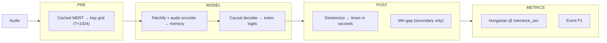
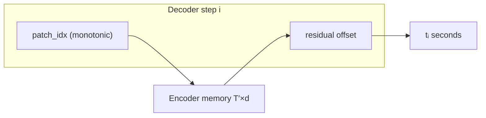

# Autoregressive onset detection — design draft

**Status:** Design locked **2026-06** (§11). **Phase 0+1 implemented** in `src/stepcovnet/onset_ar/` (2026-06-27); **`gate-tide-overfit` passed** (EXP-20260627-04) — see §10.5. Next gate: **`gate-ar-decode`**.

**Related:** [PIPELINE_ARCHITECTURE.md](PIPELINE_ARCHITECTURE.md) · [EXPERIMENT_LOG.md](EXPERIMENT_LOG.md) · [DECISIONS_CHECKLIST.md](DECISIONS_CHECKLIST.md) § C · [DATASET_PREP_PIPELINE.md](DATASET_PREP_PIPELINE.md) §2 · §11 decision registry below · historical [onset_events plan](../onset_events_plan.md)

**Sections:** [Problem §2](#2-problem-as-conditional-sequence-model) · [Architecture §7](#7-model-architecture) · [Gates §10](#10-experiment-protocol) · [Decisions §11](#11-decision-registry)

---

## 1. Motivation

Chart player-step times are an **ordered sparse list** in seconds. Three MODEL formulations exist in-repo today:

| Formulation              | Idea                                                    | Val signal (best known)                                          | Overfit (tide) |
| ------------------------ | ------------------------------------------------------- | ---------------------------------------------------------------- | -------------- |
| **Dense frames**         | Per-hop onset probability on MERT grid                  | Micro event F1 **0.686** @ thr=0.30 (`data/v2`, EXP-20260610-03) | ~98% event F1  |
| **K-query event**        | K parallel `(time, confidence)` slots + Hungarian train | ~**0.30** F1 plateau; oracle ~**0.31** (EXP-20260606-11)         | ~28–30%        |
| **AR tokens** (this doc) | Causal decoder emits ordered time tokens until EOS      | _Not run on val_                                                 | **`gate-tide-overfit` pass** — teacher-fed F1 **1.0** on tide (EXP-20260627-04) |

**Why consider AR**

- Ground truth is already sorted; training can use **next-token cross-entropy** without Hungarian assignment.
- Natural interface if downstream chart generation is **autoregressive** (onsets → arrows as token streams).
- K-query slots may have hit a **formulation ceiling**; dense wins on val but does not model global sequence structure.

**Why it might not beat dense**

- Dense MERT already exploits **local frame evidence**; most val errors may be calibration/threshold, not missing sequence modeling.
- Charts can have up to **2048** onsets — long AR decode is costly and exposure-bias prone.
- Eval uses **continuous ±20 ms** matching; token quantization must decode back to seconds without hurting F1.

**Honest prior:** AR is worth a **`gate-tide-overfit`** before multi-song val. If it cannot memorize one song, it will not beat 0.686 on val.

---

## 2. Problem as conditional sequence modeling

**Input:** MERT features aligned to the onset hop grid — shape `(T, 1024)` after PRE (see §4).

**Output:** Token sequence in chart order:

```text
<BOS>  y₁  y₂  …  yₙ  <EOS>
```

**Ground truth:** Sorted player step times — from manifest `.chart.json` via `load_chart_times_sec`, or legacy `.txt`/`.sm` via the same parsers as `onset_events/charts.py`. Same rows as dense/event training via `--training_index_path` (tide overfit: `data/v2/test/tide.txt`).

**Inference:** Autoregressive decode until `<EOS>` or max length; detokenize to seconds. Primary metric: **no** min-gap (`eval-min-gap`); optional secondary report with 50 ms min-gap.

### 2.1 Ground truth and time base

**What is labeled**

| Item                         | Policy                                                                                                                                    |
| ---------------------------- | ----------------------------------------------------------------------------------------------------------------------------------------- |
| **Target times**             | Sorted `times_sec` per chart block — **one token per player step row** (mines excluded at prep; see `arrow_rows.encode_timed_chart_rows`) |
| **Arrows / columns**         | **Not** predicted in v1 — times only (`column_codes` loaded separately for future joint models)                                           |
| **Chart vs acoustic onsets** | Model imitates **chart timing**, not generic spectral onsets                                                                              |

**Clock contract (must match event/dense loaders)**

1. Load audio from file **t = 0** (librosa, peak-normalized).
2. `duration_sec = len(waveform) / sample_rate` after optional truncate to `max_audio_seconds`.
3. Chart times come from prep `TimingData` → `times_sec` (simfile `#OFFSET` stored in `metadata.offset_sec` for traceability; **do not add offset twice** — see `dataset_prep/models.py`).
4. **Clip GT:** `times = times[times <= duration_sec]` (same as `targets.clip_times_to_duration` in `onset_events`).
5. **Drop steps beyond clip** from the AR target sequence; if the last steps fall after truncate, the target shortens and training must not supervise removed tokens.

**Index mapping (single source of truth)**

```text
frame_idx  = floor(t_sec / HOP_COEFF)          # HOP_COEFF = 0.01
patch_idx  = frame_idx // P                    # P = patch size in frames
t_from_bin = frame_idx * HOP_COEFF             # detokenize for absolute bins
```

MERT path: extract at 24 kHz → `resample_features_to_hop_grid(..., audio_duration_sec=duration_sec)` → `(T, 1024)` with `T = max(1, int(round(duration_sec / HOP_COEFF)))` (same as `ssl_features.py`).

**Long intro:** first onset may be many seconds in (ITL charts). Tokenization must represent **large initial gaps** (§6.1) — not only small deltas.

**Empty chart:** valid target is `<BOS> <EOS>` with sequence length 0; loss on EOS only.

---

## 3. Pipeline mapping

Fits the staged pipeline without changing PRE or METRICS contracts:



| Stage              | AR onset role                                                                                                       |
| ------------------ | ------------------------------------------------------------------------------------------------------------------- |
| **PRE**            | Unchanged: load audio, cache MERT, resample to `HOP_COEFF` grid (`ssl_features.resample_features_to_hop_grid`)      |
| **MODEL**          | Patch MERT → encoder memory; causal decoder → vocabulary logits                                                     |
| **POST**           | Detokenize pointer+residual (or tokens) → seconds; already ordered; **no** min-gap on primary eval (`eval-min-gap`) |
| **METRICS**        | Unchanged: Hungarian match @ `tolerance_sec=0.02` → TP/FP/FN → F1                                                   |
| **Train feedback** | Token CE (teacher forcing); val event F1 on decoded lists                                                           |

**Ordered eval shortcut:** when predictions and GT are **strictly time-sorted**, one-to-one matching @ tolerance can use a **linear merge** (two-pointer) instead of full Hungarian — equivalent for sorted lists. Keep Hungarian in the reference implementation for parity with dense/event unless profiling demands otherwise.

Log experiments with stage tag `model` (+ `pre` if hop/token ablation).

---

## 4. Three time scales (decouple them)

Dense onset **ties** feature hop and target grid. AR should **not**:

| Scale                 | Meaning                             | Default in repo                  | AR recommendation                                                    |
| --------------------- | ----------------------------------- | -------------------------------- | -------------------------------------------------------------------- |
| **A. Encoder memory** | How finely MERT is stored / patched | 10 ms frames (`HOP_COEFF=0.01`)  | Keep **10 ms** working grid; **patch/downsample** for attention (§5) |
| **B. Output tokens**  | What the decoder predicts each step | N/A (dense uses frames)          | **`delta_bucketed`** + pointer/residual heads (§6–7)                 |
| **C. Eval metric**    | Match tolerance                     | **20 ms** (`tolerance_sec=0.02`) | Fixed for comparisons                                                |

Constants: `src/stepcovnet/constants.py` — `HOP_COEFF = 0.01`, `MERT_HIDDEN_SIZE = 1024`, `MAX_STEPS = 2048` (same cap as `onset_events/charts.MAX_STEPS_PER_CHART`).

### 4.1 Is 10 ms still correct for AR?

**Encoder:** Yes — same PRE as dense; no need to change hop when switching head.

**Decoder tokens:** Independent choice. At **20 ms** eval tolerance, **10 ms tokens are already finer than the metric requires**; sub-10 ms classification tokens rarely help F1.

| Finer (&lt;10 ms)                                                                   | Coarser (&gt;10 ms)                                                    |
| ----------------------------------------------------------------------------------- | ---------------------------------------------------------------------- |
| Longer encoder if rasterized; MERT mostly **interpolated** — little new information | Shorter memory; cheaper cross-attention                                |
| Larger vocab for absolute bins; harsh CE vs forgiving metric                        | 20 ms tokens align with tolerance; risk bin collisions for close pairs |
| Use **continuous Δt** if sub-bin timing matters                                     | **80–160 ms patches** on encoder are attractive                        |

**Rule:** Do not lengthen the encoder sequence without reason; patch instead. Match token granularity to the metric unless tightening tolerance.

---

## 5. MERT → patches (encoder input)

“Patches” means compress the **MERT timeline** into a shorter memory the decoder cross-attends to — not re-segmenting raw audio.

```
MERT (T, 1024)
  → patch embed + position encoding     # (T′, d_model)
  → N_enc transformer layers            # bidirectional self-attention
  → memory for decoder
```

**Patchify options (pick one for v1):**

| Method                  | Example                      | T′ @ 300 s audio cap (P=8)  |
| ----------------------- | ---------------------------- | --------------------------- |
| Non-overlapping windows | P=8 frames → 80 ms per patch | ~30k frames → ~3.7k patches |
| Strided Conv1d          | on `(T, 1024)`               | tunable                     |
| Full T (no patch)       | tide debug only              | ~30k — too long for prod    |

**Locked (`patch-size`):** P=8. MERT **frozen** for `gate-tide-overfit`; train patch projector + encoder adapter + decoder only.

---

## 6. Tokenization (decoder output)

Finite vocabulary or continuous head required per step.

| Scheme           | Token                                   | Vocab        | Pros                               | Cons                                              |
| ---------------- | --------------------------------------- | ------------ | ---------------------------------- | ------------------------------------------------- |
| **Absolute bin** | `k = round(t / Δt)`, Δt=10 ms           | ~30k / 5 min | Simple                             | Large vocab; duplicates                           |
| **Delta**        | `Δk` since previous onset (10 ms units) | ~hundreds    | Monotonic; smaller vocab           | Error compounding; first token absolute offset    |
| **Two-level**    | coarse second + fine bin                | medium       | Shorter                            | More complex                                      |
| **Continuous**   | scalar Δt (seconds)                     | N/A          | Sub-bin timing; no vocab explosion | Regression + exposure bias; needs careful scaling |

**Special tokens:** `<BOS>`, `<EOS>`, `<PAD>` (batch only).

**Length cap:** `n_steps ≤ 2048` (+ EOS) per chart (`MAX_STEPS`).

**Locked v1 (`tokens`):** **`delta_bucketed`** — first token absolute frame index `k₀`, then Δk buckets (§6.1). Used for token CE on the causal decoder.

### 6.1 Delta vocabulary and constrained decode

**First token:** absolute frame index `k₀ = floor(t₀ / HOP_COEFF)` (or absolute bin token). Handles chart intro offset.

**Subsequent tokens:** `Δkᵢ = kᵢ − kᵢ₋₁` with `Δkᵢ ≥ 1` (at least one frame between steps; use `≥ 0` only if duplicate-frame steps are allowed — prefer **≥ 1** to match strict monotonic times).

**Vocabulary bucketing (recommended v1)**

| Token class           | Meaning                          | Notes                               |
| --------------------- | -------------------------------- | ----------------------------------- |
| `Δ = 1 … Δ_max_dense` | Small gaps (10 ms – e.g. 500 ms) | Covers most dance spacing           |
| `Δ_bucket[b]`         | Log-spaced bins for large gaps   | Silence / long intro; ~8–16 buckets |
| `<EOS>`               | End of sequence                  |                                     |

Exact `Δ_max_dense` and bucket edges: fit from **tide + 10-song** inter-onset histogram (`delta-buckets`); extend to full `final_data` before scale-up.

**Collisions:** if two GT times fall in the same 10 ms bin, **merge to one token** at train time and document in EXP; or use continuous Δt head to avoid bin collision.

**Constrained decoding (inference)**

- Cumulative time must not exceed `duration_sec`.
- Enforce `Δk ≥ 1` (or model-specific minimum).
- Optional: cap cumulative patch index ≤ `T′ − 1` when using pointer alignment (§7.5).
- POST min-gap (50 ms) **off** for primary metric (`eval-min-gap`); optional secondary report only.

---

## 7. Model architecture

Classic **encoder–decoder Transformer** (Whisper / T5 style), not parallel query slots.

### 7.1 Audio encoder

```
patch_embed: (P × 1024) → d_model   # e.g. d_model = 256–512
+ sinusoidal or learned pos enc
→ N_enc × (self-attn + FFN)           # bidirectional
→ memory (T′, d_model)
```

Optional smaller baseline: **BiLSTM** on patched MERT + **2–4 layer** causal decoder.

### 7.2 Onset decoder (causal)

Each step emits **two coupled outputs** (locked `alignment` + `tokens`):

| Head                   | Role                                                                 |
| ---------------------- | -------------------------------------------------------------------- |
| **Token LM**           | Causal CE on `delta_bucketed` IDs + `<EOS>` (§6.1)                   |
| **Pointer + residual** | `patch_idx` (monotonic) + fine offset within patch → `t_pred` (§7.5) |

```
token_embed + causal pos enc
→ N_dec × (masked self-attn, cross-attn → memory, FFN)
→ token_lm_head          # vocab logits
→ pointer_head           # T′ logits (monotonic mask at decode)
→ residual_head          # scalar or small bin within patch
```

**Consistency:** `t_pred` from pointer+residual should match detokenized token sequence; include in **`train-aux-time-loss`** (L1 between the two paths during teacher forcing).

### 7.3 Training (teacher forcing)

```text
decoder_input  = [<BOS>, y₁, y₂, …, yₙ₋₁]
decoder_target = [y₁, y₂, …, yₙ, <EOS>]
loss           = CE(decoder_target, lm_head(·))   # mask <PAD>
```

No Hungarian loss — order is fixed by sorted GT.

**Batching:** Likely `batch_size=1` initially (variable output length). Bucketing by chart length later.

**Curriculum:** tide single-song overfit → 10-song manifest subset (`data/final_data/training_index_10songs.json`, local/gitignored — see EXP-20260624-01) → full `final_data` (same as other tracks).

### 7.4 Inference

Greedy or beam search until `<EOS>` or max tokens. **Primary times** from pointer+residual heads at each step; cross-check token detokenization in diagnostics. POST: no min-gap on primary eval. METRICS: `event_onset_f1` @ `tolerance_sec` (same module as event/dense).

### 7.5 Alignment (decoder step ↔ audio memory)

Decoder index _i_ (the _i_-th onset) is **not** the same as memory index _j_ (audio time). Cross-attention alone often learns weak grounding unless structure is imposed.

**v1 (locked `alignment`): pointer + residual**

Each decode step outputs:

1. **`patch_idx`** — categorical over `T′` (or monotonic pointer: `patch_idx ≥ patch_idx_prev`).
2. **`residual`** — optional fine offset within patch (scalar in `[0, P × HOP_COEFF)` or small bin classification).

```text
t_pred = patch_idx * (P * HOP_COEFF) + residual
```

Cross-attention reads `memory[patch_idx]` (hard) or a **local window** `memory[patch_idx ± w]` (soft). Monotonic pointer mimics left-to-right chart order vs mostly-forward audio.



**Alternatives (ablation after `gate-tide-overfit`)**

| Mechanism                               | When to try                                                |
| --------------------------------------- | ---------------------------------------------------------- |
| **Free cross-attention**                | Tide overfit baseline; may work if pointer is too brittle  |
| **Continuous Δt + local window attend** | Attend to `memory[j*]` where `j* = floor(t_cum / (P·HOP))` |
| **Dense propose → AR order**            | §9 hybrid; shortest AR sequence                            |

**Decision `alignment`:** pointer+residual for v1 (locked 2026-06). Ablate free cross-attention on tide only if implementation blocks `gate-tide-overfit`.

### 7.6 Loss, length normalization, exposure bias

**Primary loss (classification path)**

```text
L_tok = CE(token_target, logits)     # mask <PAD>; include <EOS>
```

**Length normalization:** use **per-chart mean** token CE (divide by `n_steps + 1`), not sum — so 2000-step charts do not dominate 200-step charts.

**Auxiliary time loss (recommended)**

After teacher-forced tokens (or softmax mix), compute decoded `t̂ᵢ` and:

```text
L_time = mean_i |t̂ᵢ − tᵢ|        # or Huber
L = L_tok + λ_time * L_time
```

Aligns training with **20 ms** metric more than CE alone. Start `λ_time ∈ {0.1, 1.0}` on tide.

**Scheduled sampling (`gate-ar-decode` only)**

With probability `p` rising over epochs (ramp to ~0.5 per `train-scheduled-sampling`), feed **model's previous token** instead of GT into decoder input. Keep `p=0` until `gate-tide-overfit` passes. Reduces exposure bias; if teacher-forced tide passes but autoregressive decode fails, model is not ready for val.

**Val checkpointing (`train-checkpoint`):** save on **decoded event F1** (after short AR decode each epoch), not token perplexity alone — same lesson as dense frame-F1 vs event-F1.

**Augmentation:** time-stretch / spec augment **off** until `gate-tide-overfit` passes; any audio warp must warp `times_sec` consistently if enabled later.

### 7.7 EOS and sequence length

| Failure                | Symptom                                  | Mitigation                                                                                                      |
| ---------------------- | ---------------------------------------- | --------------------------------------------------------------------------------------------------------------- |
| **Early EOS**          | Mass FN                                  | EOS class weight ↓; aux `L_time`; min length = `n_gt` at train (cheat only for debug); length penalty at decode |
| **Late / missing EOS** | FP or hit `max_decode_steps`             | EOS weight ↑; stop when `patch_idx` reaches end of memory; cap `max_decode_steps = n_gt_max + margin`           |
| **Truncate mid-chart** | GT clipped, model sees full audio prefix | Target sequence uses **clipped** times only; do not supervise onsets beyond `duration_sec`                      |

**Stop criteria at inference (priority order)**

1. Sample `<EOS>` with highest log-prob above threshold (tune on val).
2. Else `patch_idx` monotonic and `t_pred > duration_sec − ε`.
3. Else `max_decode_steps` (default ≤ 2048).

**Confidence:** optional per-step max logit prob; log for diagnostics (event path lesson: slot confidence collapse). No requirement to match dense threshold sweep initially.

---

## 8. Comparison to existing formulations

### 8.1 Dense frames

| Pros                                   | Cons                                                |
| -------------------------------------- | --------------------------------------------------- |
| Proven val best; aligns with MERT grid | O(T) outputs; sparse onsets wasteful                |
| Simple BCE/Gaussian train              | Frame F1 ≠ event F1 without threshold sweep         |
| Scales to full songs                   | Weak generative story for downstream AR chart model |

### 8.2 K-query event slots

| Pros                   | Cons                                         |
| ---------------------- | -------------------------------------------- |
| One forward pass       | K≥2048; memory heavy                         |
| Set prediction framing | Hungarian train vs eval; plateau ~30%        |
|                        | Mass over-firing on slots (tide diagnostics) |

### 8.3 AR tokens (this doc)

| Pros                              | Cons                          |
| --------------------------------- | ----------------------------- |
| Matches sorted GT; CE training    | Up to 2048 decode steps       |
| No slot assignment                | Exposure bias; slow inference |
| Clean seq interface for chart gen | Tokenization vs 20 ms metric  |
| Variable count via EOS            | Untested vs dense 0.686       |

---

## 9. Hybrid directions (later)

If pure AR struggles on length or F1:

- **Dense propose, AR prune:** frame peaks → short candidate list → AR orders/filters.
- **Coarse-to-fine:** AR on 20 ms bins, then dense/refinement head within bin.
- **Chunked AR:** 30 s windows with state carry for full songs.

---

## 10. Experiment protocol

### 10.1 Experiment gates (in order)

Gate slugs name pass/fail milestones; log them in EXP entries.

| Slug                    | Config                                                                                    | Pass criterion                                                                                    |
| ----------------------- | ----------------------------------------------------------------------------------------- | ------------------------------------------------------------------------------------------------- |
| **`gate-tide-overfit`** | Locked v1 stack (§11); teacher-forced training; scheduled sampling **off**                | Token CE → ~0; pointer+residual times with **teacher-fed** decoder inputs: event F1 ≈ 1.0 on tide |
| **`gate-ar-decode`**    | Same weights as `gate-tide-overfit`; ramp scheduled sampling (`train-scheduled-sampling`) | Teacher-fed decode F1 ≈ 1.0 **and** free-running autoregressive decode F1 ≥ 0.95 on tide          |
| **`gate-10song-smoke`** | `training_index_10songs.json` (local subset)                                              | Batches build; loss decreases; decode F1 > 0; no all-EOS collapse                                 |
| **`gate-val-vs-dense`** | Full val split vs best dense run                                                          | Micro event F1 @ swept threshold                                                                  |

### 10.2 Ablations (after `gate-tide-overfit`)

| Tag      | Question                                                                               |
| -------- | -------------------------------------------------------------------------------------- |
| `pre`    | Encoder patch P ∈ {4, 8, 16}; keep 10 ms MERT grid; `final_data` MERT cache wired      |
| `model`  | Delta-10 ms vs delta-20 ms vs continuous Δt; pointer vs free cross-attn; decoder depth |
| `post`   | Min-gap on/off before metric                                                           |
| `metric` | Token CE vs decoded event F1; linear-merge vs Hungarian for sorted preds               |
| `train`  | Scheduled sampling schedule; `λ_time`; length-normalized CE                            |

Do not co-vary encoder patch and token scheme in one EXP unless hypothesis requires it.

### 10.3 Suggested commands (when implemented)

**`gate-tide-overfit`** — single song (`data/v2/test/tide`; same paths as `configs/onset_event_overfit_one.json`):

```bash
python scripts/train_onset_ar.py \
  --config configs/onset_ar_tide.json \
  --model_output_dir models/ar_tide_overfit
```

**`gate-10song-smoke`** — local 10-song manifest subset (same path as dense/event smoke in EXP-20260624-01; not git-tracked):

```bash
python scripts/train_onset_ar.py \
  --config configs/onset_ar_smoke.json \
  --training_index_path data/final_data/training_index_10songs.json \
  --model_output_dir models/ar_10song_smoke
```

WSL GPU: run from repo root per [wsl-gpu-stepcovnet](../../.cursor/skills/wsl-gpu-stepcovnet/SKILL.md). Verify tide load without training:

```bash
python scripts/train_onset_ar.py --config configs/onset_ar_tide.json --verify-only
```

Diagnose a saved checkpoint (dispatches to WSL when needed):

```bash
python scripts/debug_ar_onset_overfit.py \
  --config configs/onset_ar_tide.json \
  --model_path models_wsl/ar_tide_overfit_gate_v5/ar_onset_model.keras
```

### 10.4 Config sketch

**`configs/onset_ar_tide.json`** (`gate-tide-overfit`):

```json
{
  "dataset": {
    "overfit_audio_path": "data/v2/test/tide.ogg",
    "overfit_chart_path": "data/v2/test/tide.txt",
    "mert_features_dir": "data/v2/test",
    "max_audio_seconds": 300,
    "max_steps_per_chart": 2048
  },
  "model": {
    "patch_frames": 8,
    "d_model": 256,
    "n_enc_layers": 4,
    "n_dec_layers": 4,
    "token_scheme": "delta_bucketed",
    "alignment": "pointer_residual",
    "max_decode_steps": 2048,
    "dropout_rate": 0.0
  },
  "run": {
    "overfit_one_song": true,
    "lambda_time": 1.0,
    "lambda_time_ramp_epochs": 100,
    "lambda_residual": 5.0,
    "token_class_weight": "inverse_freq",
    "use_soft_pointer_time": false,
    "scheduled_sampling_max_p": 0.0,
    "length_normalize_ce": true,
    "tolerance_sec": 0.02,
    "checkpoint_metric": "val_event_onset_f1"
  }
}
```

**`configs/onset_ar_smoke.json`** — same model block; set `training_index_path` instead of overfit paths; `scheduled_sampling_max_p`: 0 until `gate-ar-decode`. (Smoke config **not in repo yet**.)

### 10.5 `gate-tide-overfit` notes (2026-06-27)

**Status:** **PASS** ([EXP-20260627-04](EXPERIMENT_LOG.md#exp-20260627-04-ar-gate-tide-overfit-pass-wsl-300ep)). Teacher-fed `val_event_onset_f1` **1.0** on tide (634/634 within 20 ms). Checkpoint: `models_wsl/ar_tide_overfit_gate_v5/ar_onset_model.keras`; log `logs/ar_tide_overfit_gate_v5.log`.

**Tide batch:** 634 onsets, 1607 encoder patches, vocab **339**, decoder length **635**. Tests: `tests/onset_ar/`; diagnose: `scripts/debug_ar_onset_overfit.py`.

#### Failure history (EXP-20260627-02)

First 300-ep run (`gate_v2`, pre-fix) failed: `val_token_accuracy` stuck **0.4803** (= majority token 83 frequency **305/635**), pointer near uniform, F1 peaked **~0.14** then **0.0**. Root causes: inverted attention masks (fixed `be08a5d`), majority-class token collapse, soft expected-patch F1/time path, `lambda_time=1.0` from step 0 without residual supervision. See [NOTE-20260627-01](DISCUSSION_NOTES.md#note-20260627-01-gate-tide-overfit-plateau-and-open-hypotheses).

#### Winning training recipe (EXP-20260627-03 → 04)

| Change | Purpose |
| ------ | ------- |
| `dropout_rate: 0.0` | Match dense/event overfit gates |
| `token_class_weight: inverse_freq` | Break majority delta collapse |
| `use_soft_pointer_time: false` | Argmax patch for F1 metric and time loss |
| `lambda_time: 1.0`, `lambda_time_ramp_epochs: 100` | Phase pointer CE first; ramp L1 on seconds |
| `lambda_residual: 5.0` | Direct MSE on `residual_sec` (pointer CE alone leaves sub-patch error) |

Intermediate: `gate_v4` reached F1 **~0.83** with ramp only — debug showed **0 patch errors**, **103 residual errors** (`n_patch_ok_timing_wrong`). Residual MSE closed the gap to **1.0**.

**Next gate:** [`gate-ar-decode`](#101-experiment-gates-in-order) — scheduled sampling ramp; free-running decode F1 ≥ 0.95 on tide.

---

## 11. Decision registry

**ID format:** `kebab-case` slugs (no `AR1` / `AR7` numbering). Cross-ref in EXP/NOTE text as `` `slug` ``.

### Architecture & data

| Slug              | Topic                         | Options                                                                    | Status      | Locked choice                                |
| ----------------- | ----------------------------- | -------------------------------------------------------------------------- | ----------- | -------------------------------------------- |
| `package`         | Code layout                   | `onset_ar/` vs extend `onset_events/`                                      | **decided** | `src/stepcovnet/onset_ar/`                   |
| `alignment`       | Decoder step ↔ audio memory   | pointer+residual vs free cross-attn vs continuous local vs dense→AR hybrid | **decided** | pointer+residual (§7.5)                      |
| `tokens`          | Time tokenization             | delta_bucketed vs delta_dense vs continuous Δt vs absolute_bin             | **decided** | delta_bucketed (§6.1)                        |
| `patch-size`      | MERT frames per encoder token | P=4 / 8 / 16                                                               | **decided** | P=8 (80 ms)                                  |
| `encoder-hop`     | PRE feature grid              | 10 ms vs finer raster                                                      | **decided** | 10 ms (`HOP_COEFF`)                          |
| `mert-finetune`   | MERT weights                  | frozen vs unfreeze last layer                                              | **decided** | frozen for `gate-tide-overfit`               |
| `delta-buckets`   | Long-gap vocab edges          | Histogram on tide + 10-song before multi-song                              | **open**    | fit before `gate-10song-smoke` scale-up      |
| `final-data-mert` | Nested MERT cache             | When to wire `extract_mert_features` for `final_data`                      | **decided** | after `gate-tide-overfit` + `gate-ar-decode` |

### Training & eval

| Slug                       | Topic                | Options                                   | Status      | Locked choice               |
| -------------------------- | -------------------- | ----------------------------------------- | ----------- | --------------------------- |
| `train-checkpoint`         | Val model selection  | decoded event F1 vs token CE              | **decided** | decoded event F1            |
| `train-scheduled-sampling` | Exposure bias        | ramp p vs fixed p vs off until gate fails | **decided** | ramp p → ~0.5               |
| `train-aux-time-loss`      | λ_time on \|t̂−t\|    | ramp vs fixed vs off                      | **decided** | **1.0**, linear ramp **100 ep** from 0 (`lambda_time_ramp_epochs`) |
| `train-aux-residual-loss`  | λ_residual MSE on residual head | off vs 1–5                         | **decided** | **5.0** on tide overfit (EXP-20260627-04) |
| `token-class-weight`       | Token CE class weights | none vs inverse_freq                 | **decided** | **inverse_freq** on tide |
| `decode-pointer`           | F1 / time loss decode  | soft expected patch vs argmax          | **decided** | **argmax** (`use_soft_pointer_time: false`) |
| `eval-min-gap`             | 50 ms POST before F1 | off primary vs report both vs on primary  | **decided** | off for primary metric      |
| `dense-baseline`           | Scoreboard vs dense  | replace vs supplement                     | **decided** | dense until AR beats val F1 |

### Strategic (outside v1 impl)

| Slug        | Topic                                     | Status                                |
| ----------- | ----------------------------------------- | ------------------------------------- |
| `ship-path` | Generator: dense vs AR times vs undecided | **open** — see DECISIONS_CHECKLIST F3 |

Update [DECISIONS_CHECKLIST.md](DECISIONS_CHECKLIST.md) § C when slugs move to **decided** or **open** (link EXP/NOTE).

**v1 stack (locked):** `onset_ar/` · pointer+residual · delta_bucketed · P=8 · frozen MERT · checkpoint=`train-checkpoint` · scheduled sampling ramp · eval min-gap off.

---

## 12. Downstream chart generation (out of v1 scope)

v1 AR onset predicts **times only**. Full StepCOVNet generation needs **(time, arrow)** per step.

**Planned two-stage (matches current generator)**

```text
audio → AR_onset → [t₁, t₂, …, tₙ]
                 → AR_arrow (or frame model) → column_codes
                 → chart.txt
```

**Future joint format (sketch)**

Interleaved token stream per step (order fixed):

```text
<t_bin_₁> <arrow_₁> <t_delta_₂> <arrow_₂> … <EOS>
```

- `<arrow_*>`: 256-class panel encoding (existing arrow model) or 4-panel factorization.
- Shared audio encoder; separate heads or single decoder with typed tokens.
- Train only after `gate-val-vs-dense` or on **frozen** time stream from best onset model.

Do not block onset AR on joint modeling — time-only F1 is the gate.

---

## 13. Implementation notes

- Reuse PRE: `ssl_features.load_mert_features`, `resample_features_to_hop_grid`, `pairing` / `training_index` rows.
- Reuse GT loaders: `dataset_prep/training_loader.load_chart_times_sec` (`.chart.json`); `onset_events/charts.py` for legacy `.txt`/`.sm` and tide overfit paths.
- **Tide MERT cache:** `data/v2/test/tide.mert.npy` (or beside-audio `.mert.npy`) for `gate-tide-overfit`.
- **`final_data` MERT:** wire nested extract before `gate-val-vs-dense` on full corpus (`final-data-mert`); not required for tide gates.
- Reuse METRICS: `onset_events/matching.py`, `metrics.py` on decoded time lists; optional sorted linear merge (§3).
- GT times are **continuous seconds** from simfile; tokenize with §2.1 / §6.1 rules — not dense `int(time/HOP)` unless ablating parity.
- Truncation: mirror `onset_events.datasets` — clip GT to waveform duration before building the token sequence.
- Variable output length (no fixed `n_max_onsets` pad like event path unless batching requires it).
- **Diagnostics to log:** token accuracy, pointer/residual vs token time agreement, mean |Δt| error, EOS step index, pointer monotonicity violations; **per-step argmax token histogram** when accuracy plateaus near a rational fraction of sequence length (majority-class baseline check).
- **Code map:** `targets.py` (tokenization) · `datasets.py` (MERT patches + batch) · `models.py` (enc/dec + masks) · `losses.py` · `inference.py` (teacher-fed F1 times) · `trainers.py` · `scripts/train_onset_ar.py`.

---

## 14. References in-repo

| Topic                       | Location                                                                 |
| --------------------------- | ------------------------------------------------------------------------ |
| Hop / MERT width            | `src/stepcovnet/constants.py`, `ssl_features.py`                         |
| GT clip / pad               | `onset_events/targets.py`, `onset_events/datasets.py`                    |
| Chart times (manifest)      | `dataset_prep/training_loader.load_chart_times_sec`                      |
| Chart times (legacy / tide) | `onset_events/charts.py` (`_parse_step_times`)                           |
| Tide overfit paths          | `configs/onset_event_overfit_one.json`, `configs/overfit_tide/mert.json`, `configs/onset_ar_tide.json` |
| AR trainer / gate debug     | `scripts/train_onset_ar.py`, `logs/ar_tide_overfit_gate_v2.log`, EXP-20260627-02 |
| Dense frame targets         | `datasets._create_target`, `_create_target_gaussian` in `datasets.py`    |
| Event plateau               | EXP-20260606-08 … 11 in [EXPERIMENT_LOG.md](EXPERIMENT_LOG.md)           |
| Formulation / gates         | [DECISIONS_CHECKLIST.md](DECISIONS_CHECKLIST.md) § C                     |
| Training data               | [DATASET_PREP_PIPELINE.md](DATASET_PREP_PIPELINE.md) §2                  |

---

_Update §10.5 when `gate-ar-decode` passes or architecture changes._
