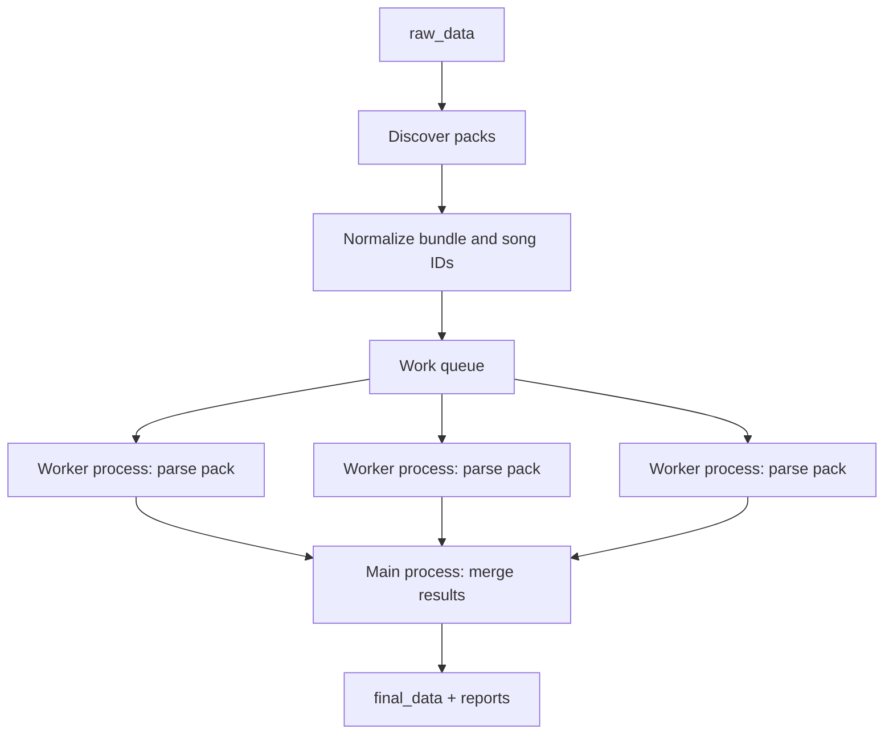

# Dataset preprocessing pipeline — plan

**Status:** Design doc — decisions locked **2026-06-10** (§14); layout nested bundles **2026-06-10** (§1, §7, 1.4); field rationale **2026-06-14** (§6.3); audit **2026-06-10** (§15). **Implementation:** P0–P7 + P6 + **P9 done** (2026-06-22); local `data/final_data` has **1942** chart rows from three bundles; **P8** (`training_index.json` + train/val split) is next.  
**Related:** [PIPELINE_ARCHITECTURE.md](PIPELINE_ARCHITECTURE.md) (PRE stage) · [project-layout.md](../agents/project-layout.md) · [EXPERIMENT_LOG.md](EXPERIMENT_LOG.md) § Current phase

**Default paths (configurable):**

| Role                     | Default           |
| ------------------------ | ----------------- |
| Input (raw song packs)   | `data/raw_data`   |
| Output (processed packs) | `data/final_data` |

---

## 1. Goal

Convert downloaded StepMania song packs (nested folders with audio + `.sm`/`.ssc`) into a **stable training layout** that **mirrors raw_data bundle nesting** — not a flat dump of all songs at the output root.

```
data/raw_data/                          data/final_data/
  ITL Online 2026/                        name_map.json
    [12] Expanded.../                       preprocess_report.json
      Expanded.ogg                          itl_online_2026/          ← normalized bundle
      sm.ssc                                  expanded/                ← normalized song
  Mizuki's Simfiles/                            expanded.ogg
    #74/                                        expanded.chart.json
      ....sm                                    expanded.txt           (optional)
                                              mizukis_simfiles/
                                                ...
```

**Output path rule:** `{output_dir}/{normalized_bundle}/{normalized_id}/`  
**Manifests** (`name_map.json`, reports) stay at **`output_dir` root** only.

Per song directory:

```
{normalized_bundle}/{normalized_id}/
  {normalized_id}.{ext}       # audio (original ext: .ogg, .mp3, …)
  {normalized_id}.chart.json  # canonical parsed object
  {normalized_id}.txt         # legacy v2 (optional; off by default)
```

Stage 1 scope: **discover → normalize bundle + song names → parse simfile → convert to seconds → validate → write**.  
Out of scope: MERT extraction, train/val split, model training.

---

## 2. Training data paths (current)

| Layout | Role | Loader entry point |
| ------ | ---- | ------------------ |
| `data/final_data/{bundle}/{id}/` | **Primary** — nested prep output: audio + `{id}.chart.json` (multi-chart in one JSON) | `training_loader.discover_training_rows`, `pairing.list_training_samples` |
| `data/v2/{train,val}/<id>/` | Legacy flat layout — `.ogg` + `.txt` | `pairing.list_training_samples` (falls back to `.txt` pairs, `chart_index=0`) |
| `data/raw_data/` | Raw simfile packs (input to prep only) | `scripts/preprocess_dataset.py` |

**P9 (done):** trainers and onset dataloaders consume `(audio_path, chart_json_path, chart_index)` from `final_data`. `datasets._parse_step_chart` and `onset_events.charts` read `.chart.json` blocks by `chart_index`; legacy `.txt` / `.sm` still supported.

**P8 (done):** point training at ``training_index.json`` directly or at the prepared
output root. The manifest's ``output_dir`` plus relative ``audio_relpath`` /
``chart_relpath`` entries tell loaders where files live.

```bash
venv\Scripts\python.exe scripts\build_training_index.py --output-dir data/final_data --overwrite
```

Load samples:

```python
pairing.list_training_samples("data/final_data/training_index.json", split="train")
```

Train (manifest is the only data pointer needed):

```bash
python scripts/train_onset_event.py --config=... \
  --training_index_path=data/final_data/training_index.json \
  --model_output_dir=models/onset_event
```

Legacy: ``data_dir=val_data_dir=data/final_data`` still auto-splits when the index
sits under that root.

**Raw gap (prep input):** ITL packs often have `Expanded.ogg` + `sm.ssc` with **non-matching stems** — resolved in prep via `#MUSIC` + audio inference (§8.2), not at train time.

---

## 3. Simfile evaluation (ITL smoke 2026-06-13; multi-bundle survey 2026-06-10)

**Decision: use `[simfile](https://pypi.org/project/simfile/)` 2.1.1** as an optional dependency (`stepcovnet[dataset-prep]`).

Quick test on `data/raw_data/ITL Online 2026` (310 packs):

| Outcome                                   | Count   | Notes                                                        |
| ----------------------------------------- | ------- | ------------------------------------------------------------ |
| OK (`dance-single` + audio + timed steps) | **250** | Ready for default policy (1 pack uses audio inference, §8.2) |
| No `dance-single` chart                   | **60**  | **Skipped** — no fallback to other stepstypes (see §8.1)     |
| `#MUSIC` file absent (inference resolves) | **1**   | `[07] N1ghtmare (SM) [Scrypts]` — not skipped under §8.2     |
| Parse errors                              | **0**   | All `.ssc` opened successfully                               |

**Multi-bundle re-survey (2026-06-10)** — one-off survey script on all three folders under `data/raw_data/` (historical counts in §3 table; re-run discovery with `preprocess_dataset.py --dry-run`).

| Bundle                            | Packs | Parse fail | `dance-single` OK  | Multi-single packs | Charts (singles) | Over 2048 charts | Audio issues |
| --------------------------------- | ----- | ---------- | ------------------ | ------------------ | ---------------- | ---------------- | ------------ |
| **ITL Online 2026**               | 310   | 0          | 250 (60 no single) | 0                  | 250              | 1                | 1 infer      |
| **Mizuki's Simfiles**             | 821   | **5**      | 816 (0 no single)  | **451** (55%)      | **1328**         | **18**           | 6 infer      |
| **Vocaloid Project Pad Pack 4th** | 76    | 0          | 76                 | **76** (100%)      | **393**          | 2                | 0            |

**Assumptions that still hold**

- Flat pack layout (one simfile + audio per child dir) — all three bundles.
- `simfile` parses both `.ssc` (ITL) and `.sm` (Mizuki, Vocaloid).
- `dance-single`-only filter works; doubles-only skip is **ITL-specific** (~19%), not global.
- Audio resolution (`#MUSIC` + inference) — 99%+ success; heuristics still needed.
- Note-type mapping (§6.1) — no new simfile types seen.

**Assumptions that break or need doc/code tweaks** (see §3.1)

| Old assumption (ITL-only)               | New data says                                                                                                              |
| --------------------------------------- | -------------------------------------------------------------------------------------------------------------------------- |
| One `dance-single` per pack             | Mizuki and Vocaloid have **multiple singles per pack** → **`export_all_singles` required** for difficulty training         |
| `meter` tracks hardness                 | Mizuki: **419 packs** where **Beginner `#METER` > Challenge `#METER`** → **`highest_meter` removed**; store raw meter only |
| All charts are `#DIFFICULTY: Challenge` | Vocaloid: full **Beginner→Challenge** ladder (+ **13 `Edit`** charts); Mizuki: mostly Challenge + Beginner                 |
| Parse always succeeds                   | Mizuki: **5** failures (4× `UnicodeDecodeError` on Shift-JIS `.sm`, 1× corrupt/BOM)                                        |
| Step count ≤ 2048 covers corpus         | **21 charts** over cap (Mizuki medley max **~8805** steps) — **skip chart** by default; `--allow-over-cap` optional        |
| ITL meter 7–15                          | Combined meters **1–20** (+ one Mizuki **meter=99** outlier; store raw, normalization deferred)                            |

### 3.1 Bundle-specific notes (2026-06-10)

**Mizuki's Simfiles** (821 `.sm` packs)

- Typical pack: **Challenge + Beginner** (397 packs have exactly 2 singles); up to 5 singles on a few packs.
- **Beginner meter often exceeds Challenge meter** — authors use the Beginner slot for dense “extra” charts. **`highest_meter` was removed** (§14); export all charts and store labels as-is.
- **5 unpackable packs** — retry open with explicit encodings (`utf-8-sig`, `cp932`, `shift_jis`); status `encoding_error` if still failing. One pack has MSD stray-byte parse error.
- **18 / 1328** charts exceed 2048 steps (medleys); longest pack ~8805 steps.
- Extras: mines only (no rolls/fakes/lifts in aggregate); one **meter=99** chart.

**Vocaloid Project Pad Pack 4th** (76 `.sm` packs)

- **Every pack** has 5–6 `dance-single` charts: Beginner (m1) → Easy → Medium → Hard → Challenge, meters increase monotonically — **ideal multi-difficulty corpus**.
- **13 `Edit` charts** (custom `#DIFFICULTY`, not in standard enum) — store raw string + `difficulty_kind: "custom"`; do not map to 0–4 index without an explicit rule.
- **2 / 393** charts over 2048 (e.g. Ultimate Medley).
- Rolls + mines present.

**Recommended pipeline defaults when all three bundles are ingested**

1. **`export_mode=export_all_singles`** — every dance-single chart in `charts[]`.
2. **`default_chart_index`** from highest ladder rank (§8.1), not meter.
3. **Encoding fallback** before marking pack failed (§5.3).
4. **Skip charts over 2048** unless `--allow-over-cap`; record in `preprocess_report.json` `chart_skips` (§7.4).
5. **Nested output** `{normalized_bundle}/{normalized_id}/` with normalized bundle folder names (§7).

Re-run discovery (repo root, Windows CPU venv):

```bash
venv\Scripts\python.exe scripts\preprocess_dataset.py --dry-run --input-dir data/raw_data --output-dir data/final_data
```

**API surface (v2.1.1):**

```python
import simfile
from simfile.notes import NoteData
from simfile.notes.timed import time_notes
from simfile.timing import TimingData

sim = simfile.open("pack/sm.ssc")
chart = ...  # selected chart
timing = TimingData(sim, chart)       # handles SSC split timing
note_data = NoteData(chart)
timed = list(time_notes(note_data, timing))  # SongTime + Note per row
```

**Caveats to document in code:**

- `fs` dependency emits a `pkg_resources` deprecation warning (harmless for now).
- `TimingEngine` lives in `simfile.timing.engine` (not re-exported from `simfile.timing`).
- Beat-grouped arrow rows must be built from `TimedNote` stream (simfile yields per-column notes, not pre-joined `0100` rows).

**Fallback:** if `simfile` import fails, CLI exits with install instructions — no partial custom SSC parser in v1.

---

## 4. Pipeline stages (PRE)



| Stage           | Input                   | Output                                                     |
| --------------- | ----------------------- | ---------------------------------------------------------- |
| Discover        | `--input-dir`           | List of pack paths + simfile/audio + bundle context        |
| Normalize       | Pack list + titles      | `name_map.json` with `normalized_bundle` + `normalized_id` |
| Parse + convert | One pack + assigned ids | `ParsedSongPack` in memory                                 |
| Validate        | Parsed object           | pass / warn / fail                                         |
| Write           | Parsed object + ids     | `{output_dir}/{normalized_bundle}/{normalized_id}/`        |
| Report          | All worker results      | `preprocess_report.json` at output root                    |

### 4.1 Discovery rules

**Pack** = directory that directly contains at least one `*.ssc` or `*.sm` (non-recursive).

**Bundle** = how output nesting is grouped:

| `--input-dir` points at                    | Bundles discovered                                       | Packs discovered                                                                       |
| ------------------------------------------ | -------------------------------------------------------- | -------------------------------------------------------------------------------------- |
| Multi-bundle root (e.g. `data/raw_data/`)  | Each **immediate child directory** that contains ≥1 pack | **Direct child** dirs of that bundle only (one level; no nested `pack/subpack/` in v1) |
| Single bundle (P7: `.../ITL Online 2026/`) | That directory alone (`source_bundle` = basename)        | Immediate child dirs that are packs                                                    |

**Simfile choice per pack:** prefer `*.ssc` over `*.sm` if both exist; else first by sorted name.

**Not a pack:** bundle folders with no simfile-containing child (empty bundle) → report warning, zero packs.

**Discovery does not** recurse deeper than pack depth (no nested `pack/subpack/` unless we add it later).

---

## 5. Batch execution (`preprocess_dataset.py`)

One CLI runs the pipeline **in order**: discover → normalize → process packs → merge report. Implementation is **sequential by phase** (P0→P7 in §10). Within a batch run, only **pack processing** is parallel — controlled by **`--workers N`** (default `1`) via a process pool inside the script.

Run from **repository root** (Windows CPU venv):

```bash
venv\Scripts\python.exe scripts\preprocess_dataset.py ^
  --input-dir "data/raw_data/ITL Online 2026" ^
  --output-dir data/final_data ^
  --workers 8
```

`--dry-run` stops after O1+O2 (no pool, no pack writes).

| Component         | Responsibility                                                                 | When it runs                       |
| ----------------- | ------------------------------------------------------------------------------ | ---------------------------------- |
| **Main process**  | O1 discover, O2 normalize (global slugs), O3 dispatch pool, O4 merge manifests | Always serial for O1/O2/O4         |
| **Pool worker**   | W1–W3 for one pack: parse → validate → write                                   | Up to `--workers` at once after O2 |
| **P6 validation** | Round-trip tests on written `chart.json` / optional `.txt`                     | pytest only                        |

### 5.1 Phases O1–O4

```
Phase O1 — Discover
  Input:  --input-dir
  Output: packs_manifest.json
          Each pack: {pack_relpath, simfile, source_bundle, bundle_relpath}
          bundle = immediate child of --input-dir when input is a multi-bundle root,
                   OR basename of --input-dir when input points at one bundle (P7)

Phase O2 — Normalize (global)
  Input:  packs_manifest.json
  Output: name_map.json (draft)
  Step A: Assign normalized_bundle per distinct source_bundle (slug §7.1); collisions _2 at bundle level
  Step B: Assign normalized_id per pack, unique within normalized_bundle (slug §7.2); collisions _2 within bundle
          **Requires lightweight simfile read** per pack: TITLE → TITLETRANSLIT → pack folder (§7.2), same encoding retries as W1.
          Dry-run (`--dry-run`): may use pack folder name only for slug preview; full run must parse metadata before dispatch.
  Note:   MUST be serial — collision suffixes need full-table view per scope

Phase O3 — Dispatch (process pool)
  Input:  name_map.json entries with status=pending
  Output: each pool worker receives one work item:
          {normalized_bundle, normalized_id, pack_relpath, simfile, output_dir}
  Control: --workers N caps concurrent pack processes

Phase O4 — Merge
  Input:  per-pack worker results (from pool; written to staging or collected in memory)
  Output: final name_map.json + preprocess_report.json
  Main process aggregates; one failed pack does not block merge of the rest
```

### 5.2 Per-pack work (W1–W3)

Each worker process is **stateless** except for its assigned `normalized_bundle` and `normalized_id` (pre-resolved in O2).

```
Phase W1 — Parse
  - simfile.open with auto-detect; encoding retry utf-8-sig, cp932, shift_jis, euc-jp on failure
  - filter charts to stepstype == dance-single only; if none → skip pack (status: no_dance_single)
  - export **every** dance-single chart when export_mode=export_all_singles (§8)
  - per chart: skip if steps=0, steps>cap, or hold validity fails (§9); skip pack if none left
  - default_chart_index = highest standard ladder rank (Challenge > Hard > … > custom)
  - resolve audio: #MUSIC path, else infer from pack dir (§8.2)
  - TimingData(sim, chart) + time_notes → beat rows (§6.1)
  - build ParsedSongPack dataclass

Phase W2 — Validate
  - audio file resolved (explicit or inferred)
  - at least one chart exported after per-chart skips
  - times monotonic per chart

Phase W3 — Write (atomic)
  - write to {output_dir}/{normalized_bundle}/{normalized_id}.tmp/
  - copy audio (always copy; keep source extension in output basename)
  - write {normalized_id}.chart.json
  - optional: multi-block legacy {normalized_id}.txt if --export-legacy-txt
  - rename tmp → {output_dir}/{normalized_bundle}/{normalized_id}/
  - emit worker_result.json: {normalized_bundle, normalized_id, status, warnings, stats}
```

**Parallelism:** the main process runs `W1–W3` for packs 1…N via a pool (`--workers`). Workers only write distinct `{normalized_bundle}/{normalized_id}/` trees.

**Not parallelizable in one run:** O2 (global slug table), O4 merge (single writer).

### 5.3 Staging layout

```
data/final_data/
  _staging/
    worker_results/
      itl_online_2026__expanded.json
      ...
  name_map.json
  preprocess_report.json
  itl_online_2026/
    expanded/
  mizukis_simfiles/
    ...
```

The main process may write per-pack results under `_staging/worker_results/` during the pool run, then finalize manifests after O4. Optional optimization — not required for `--workers 1`.

---

## 6. Data model

New package: `src/stepcovnet/dataset_prep/`

Field-level **why** for every exported key: **§6.3** (schema versions + rationale tables).

```python
@dataclass
class BpmSegment:
    start_beat: float             # beat index from simfile #BPMS
    bpm: float

@dataclass
class SimfileMetadata:
    title: str
    artist: str
    subtitle: str
    music_filename: str
    offset_sec: float             # from simfile; chart times from TimingData only (§15.7)
    initial_bpm: float            # bpm_segments[0].bpm; skip pack if #BPMS empty
    bpm_segments: list[BpmSegment]  # full #BPMS ladder; per-chart times use TimingData
    selectable: bool

@dataclass
class ChartSummary:
    stepstype: str
    difficulty: str               # lowercase
    difficulty_kind: str          # "standard" | "custom"
    meter: int                    # raw from simfile; cross-artist normalization deferred
    chart_name: str
    credit: str
    num_steps: int

@dataclass
class ParsedChart:
    summary: ChartSummary
    times_sec: list[float]
    arrow_rows: list[str]       # "0100", "0130", …
    column_codes: list[int]     # base-4 int (arrow model compat)

@dataclass
class ParsedSongPack:
    schema_version: int         # start at 1
    normalized_bundle: str      # slug of source bundle folder (§7.1)
    normalized_id: str          # slug of song within bundle (§7.2)
    source_pack_relpath: str
    source_simfile: str
    metadata: SimfileMetadata
    charts: list[ParsedChart]   # all exported dance-single charts
    default_chart_index: int    # highest ladder rank present (C>H>M>E>B>custom)
    available_charts: list[ChartSummary]  # non-dance-single charts only (inventory)
    audio_filename: str         # basename in output dir (keeps source ext)
    audio_source: str           # "music_tag" | "inferred"
    audio_resolved_relpath: str  # path within pack dir that was used
    warnings: list[str]
```

### 6.1 Simfile note → quaternary row mapping

Each **step row** is one **beat** with:

- `times_sec[i]` — song time for that beat
- `arrow_rows[i]` — four characters, one **per column** (dance-single: left, down, up, right)
- `column_codes[i]` — `int(arrow_rows[i], 4)`

Think of `arrow_rows` as four independent column slots. **`0` always means “nothing to step in this column on this beat.”** It is not a special “mine digit” or “fake digit.”

#### How one row is built (per beat)

1. Start with `['0','0','0','0']`.
2. For each simfile note on this beat (after `ROLL_HEAD` → `2` mapping), if the note type is encodable (`1`/`2`/`3`), set that **column** to the character.
3. Notes that are **not encodable** (`M`, `F`, `L`, keysounds, etc.) **do not change any column** — the slot stays `0` as if that column were empty.
4. **Conflict** on the same column: prefer `3` > `2` > `1`.
5. If the row is still `0000` after steps 2–3, **drop the whole beat** (do not append to `times_sec` / `arrow_rows`). No timestamp row for “empty” beats.

Characters must stay in **`0`–`3`** so `column_codes` matches `datasets._base4_to_int` and chart-validity rules in `metrics.compute_chart_validity_violations`.

#### Encodable types

| Simfile `NoteType`  | Char in `arrow_rows` | Meaning for training                               |
| ------------------- | -------------------- | -------------------------------------------------- |
| (no note in column) | `0`                  | Empty column                                       |
| `TAP`               | `1`                  | Tap / jump the player hits                         |
| `HOLD_HEAD`         | `2`                  | Hold start                                         |
| `TAIL`              | `3`                  | Hold end                                           |
| `ROLL_HEAD`         | **`2`**              | Treated as hold start for v1 (keeps range `0`–`3`) |

#### Non-encodable types (column stays `0`; may drop row)

These are **not** written into the quaternary string. They are **not** converted to digit `0` as a distinct symbol — they simply **leave that column unset**, which is already `0`.

| Simfile `NoteType` | Char in simfile | v1 behavior                                                                                                                    |
| ------------------ | --------------- | ------------------------------------------------------------------------------------------------------------------------------ |
| `MINE`             | `M`             | Shock / hazard — **do not step**. Column unchanged → `0`. Mine-only beats → whole row dropped.                                 |
| `FAKE`             | `F`             | Fake arrow (visual only). Column unchanged → `0`. Same drop rule if beat becomes `0000`.                                       |
| `LIFT`             | `L`             | Lift mechanic (rare). Column unchanged → `0`; same drop rule.                                                                  |
| `ATTACK`           | `A`             | Not seen in ITL singles smoke; skip like F/L/M.                                                                                |
| `KEYSOUND`         | `K`             | Usually metadata on a tap in SSC (`1[K]`), not a separate step row; if a standalone `K` note appears, skip (column stays `0`). |

**ITL smoke (250 dance-single charts):** taps/holds/tails dominate; also **3581 mines** (135 packs), **26 fakes** (2 packs), **51 lifts** (2 packs). No standalone keysound-only rows.

#### Examples

| Beat contents (simfile) | `arrow_row` | Row kept?                             |
| ----------------------- | ----------- | ------------------------------------- |
| Tap column 0 only       | `1000`      | Yes                                   |
| Mine column 2 only      | `0000` →    | **No** (drop beat; not a player step) |
| Tap col 0 + mine col 2  | `1000`      | Yes (mine ignored; col 2 stays `0`)   |
| Fake col 1 only         | `0000` →    | **No**                                |

**Onset-only note:** dropped mine/fake/lift-only beats are **not** in the step list — same as today’s `data/v2` `.txt` charts, which only encode player steps. Optional future field: `mine_times_sec` for hazard research; not in v1 legacy export.

Log on pack: `mine_notes_unencoded`, `fake_notes_unencoded`, `lift_notes_unencoded`, `beats_dropped_empty`.

### 6.2 Difficulty — parse, store, and train for controllable charts

**Goal:** preprocessing should preserve enough metadata that a downstream model can learn **audio → chart at difficulty D** and, at inference, accept a **target difficulty** (user knob).

#### What simfile provides (per chart block)

| Field        | Simfile tag    | Meaning                                                                          |
| ------------ | -------------- | -------------------------------------------------------------------------------- |
| `stepstype`  | `#STEPSTYPE:`  | e.g. `dance-single` (v1 export filter)                                           |
| `difficulty` | `#DIFFICULTY:` | Ladder slot: **Beginner, Easy, Medium, Hard, Challenge** (case-insensitive)      |
| `meter`      | `#METER:`      | Foot rating integer (typically 1–32+); **primary hardness scalar** in many packs |
| `chart_name` | `#CHARTNAME:`  | Optional display label (often empty; do not use as primary key)                  |

Parse `difficulty`, `meter`, and `chart_name` into every `ChartSummary`. Normalize standard difficulties to lowercase. Non-standard names (e.g. **Edit**) → `difficulty_kind: "custom"` + warning `custom_difficulty` (§8.1).

**Do not collapse difficulty into meter alone.** Two charts can share a name (both “Hard”) with different meters, or share meter with different names. Store both.

#### ITL 2026 reality (250 `dance-single` charts)

| Observation                                         | Implication                                                                                                          |
| --------------------------------------------------- | -------------------------------------------------------------------------------------------------------------------- |
| Every chart is `#DIFFICULTY: Challenge`             | **Name ladder is not informative** in this corpus                                                                    |
| **0** packs with more than one `dance-single` chart | No within-song Easy vs Hard pairs from ITL alone                                                                     |
| `meter` ranges **7–15** (mode ~11)                  | **Meter is the difficulty axis** for ITL — treat it as the conditioning label until multi-difficulty packs are added |

For ITL-only training of “make it easier/harder,” the controllable knob is **`target_meter`** (or derived step density), not `difficulty=Easy`.

#### Mizuki + Vocaloid (2026-06-10 add) — overrides ITL-only picture

| Source                | Multi-chart packs | Difficulty ladder                                | Meter vs name                                       |
| --------------------- | ----------------- | ------------------------------------------------ | --------------------------------------------------- |
| **Vocaloid Pad 4th**  | 76/76 (100%)      | Full B/E/M/H/C per song (+ optional **Edit**)    | Meters **increase** with standard ladder            |
| **Mizuki's Simfiles** | 451/816 (55%)     | Mostly **Challenge + Beginner**; some 3–5 charts | **419 packs**: Beginner meter **>** Challenge meter |

With Mizuki + Vocaloid in the mix:

- **`export_all_singles`** is mandatory for difficulty-conditioned training (~**1971** chart rows from ~**1142** songs).
- **`difficulty_index`** (Beginner→Challenge) is meaningful on Vocaloid; on Mizuki treat the **Beginner slot skeptically** (often harder by meter).
- Store **Edit** and other non-enum names with `difficulty_kind: "custom"` (13 Edit charts in Vocaloid).
- Combined **meter range 1–20**; store outliers (e.g. meter **99**) raw — cross-artist normalization **deferred** (§15).

#### Which charts to export

**Default:** parse **every** `dance-single` chart in the simfile into `charts[]`; one shared audio file per song pack.

**`available_charts`:** summaries of **non-`dance-single`** charts only (e.g. dance-double). Skipped singles (over cap, invalid holds, empty) are **not** in `charts[]`; log skip reason in pack `warnings` and `preprocess_report.json` with chart `(difficulty, meter)` identity.

**Derived stats in v1:** `num_steps` only (§14 3.5). Do not emit `steps_per_second` / hold fractions until schema v2 (§15.2).

#### On-disk layout (one song, multiple difficulties)

**Canonical JSON** — one file, many charts:

```json
{
  "schema_version": 1,
  "normalized_bundle": "vocaloid_project_pad_pack_4th",
  "normalized_id": "example_song",
  "metadata": {
    "title": "...",
    "initial_bpm": 170.0,
    "bpm_segments": [
      { "start_beat": 0.0, "bpm": 170.0 },
      { "start_beat": 64.0, "bpm": 85.0 }
    ]
  },
  "charts": [
    {
      "summary": {
        "stepstype": "dance-single",
        "difficulty": "easy",
        "difficulty_kind": "standard",
        "meter": 5,
        "num_steps": 412
      },
      "times_sec": [],
      "arrow_rows": [],
      "column_codes": []
    }
  ],
  "default_chart_index": 0
}
```

**Training index** _(P8 — next; example shape)_ — flat manifest row per `(song, chart)` so dataloaders do not special-case multi-chart JSON:

```json
{
  "normalized_id": "example_song",
  "chart_index": 1,
  "normalized_bundle": "vocaloid_project_pad_pack_4th",
  "output_relpath": "vocaloid_project_pad_pack_4th/example_song",
  "difficulty": "hard",
  "meter": 9,
  "audio_path": "...",
  "chart_path": ".../example_song.chart.json"
}
```

**Legacy `.txt`** — already supports multiple blocks (see `generator.OutputData`); format:

```
DIFFICULTY Easy
0100 12.34
...
DIFFICULTY Hard
0100 12.34
...
DIFFICULTY
```

**Loaders (P9):** `datasets._parse_step_chart(..., chart_index=)` and `onset_events.charts.load_onset_times(..., chart_index=)` select the correct block from `.chart.json`. Legacy `.txt` multi-block files still parse only the **first** difficulty section unless migrated to JSON.

**P6 legacy round-trip:** when `--export-legacy-txt`, validate **only the `default_chart_index` chart** round-trips through `_parse_step_chart` (times + `column_codes`). Other `.txt` blocks remain export-only.

#### Model conditioning (downstream, not prep v1)

Preprocessing **stores** labels; the model **consumes** them. Recommended control vector at train/inference:

| Signal                                      | Type                              | Notes                                                             |
| ------------------------------------------- | --------------------------------- | ----------------------------------------------------------------- |
| `meter`                                     | int scalar (normalize e.g. `/32`) | Primary knob; matches ITL and player “foot rating”                |
| `difficulty_index`                          | int 0–4                           | Map Beginner→0 … Challenge→4 (`_DIFFICULTY_MAP` in `datasets.py`) |
| Optional `target_steps` or `target_density` | scalar                            | User-facing “fewer arrows” without knowing meter                  |

Same audio, different `(meter, difficulty)` → **different training rows**. For songs with only one chart (ITL), meter still labels that row; augmentation across songs teaches meter↔density.

At inference: pass desired `target_meter` (+ optional `difficulty_index`) into the arrow/onset head the same way BPM or duration is passed today.

**Not recommended as primary difficulty:** raw quaternary strings, chart credit, or pack folder names.

Serialization: JSON via existing `_DictSerializableMixin` pattern in `config.py`.  
Load: `dataset_prep.load_parsed_song(output_dir, normalized_bundle, normalized_id)`.

Legacy export (`.txt`) matches `data/v2` format for current trainers. **`BPM`** line uses `metadata.initial_bpm` (first `#BPMS` value).

```
TITLE {title}
BPM   {bpm}
NOTES
DIFFICULTY {difficulty}
{arrows} {time_sec}
...
DIFFICULTY
```

### 6.3 Schema versions and field rationale

Design docs must record **why each field exists**, not only its type. This section is the canonical reference for prep output JSON; cross-link from code and loaders here.

#### What `schema_version` is

An **integer contract tag** on each JSON artifact. It answers: _which field layout and semantics should a reader assume?_

| Artifact           | Path                                         | `schema_version` in v1 |
| ------------------ | -------------------------------------------- | ---------------------- |
| Parsed song        | `{output_dir}/{bundle}/{id}/{id}.chart.json` | **1**                  |
| Discovery manifest | `{output_dir}/name_map.json`                 | **1**                  |
| Batch report       | `{output_dir}/preprocess_report.json`        | **1**                  |

**Loader rule:** read `schema_version` first; reject or branch on unknown values. Do **not** infer version from presence of optional keys alone.

**When to bump**

| Version           | Trigger                                 | Examples                                                                                                                    |
| ----------------- | --------------------------------------- | --------------------------------------------------------------------------------------------------------------------------- |
| **1**             | P0–P7 initial ship                      | Current §6 dataclasses                                                                                                      |
| **2** _(planned)_ | Breaking or semantically changed fields | `ChartSummary` gains `steps_per_second` (§15.2); optional `mine_times_sec` on chart (§15.4); renamed/removed top-level keys |
| **2+**            | Same rules                              | Any change that would make an old loader misread data                                                                       |

Backward-compatible **optional** keys (old loaders ignore) _may_ stay on v1 if documented; **removed, renamed, or changed-meaning** fields require a bump.

#### Version changelog

| `schema_version` | Date          | Summary                                                                                                        |
| ---------------- | ------------- | -------------------------------------------------------------------------------------------------------------- |
| **1**            | 2026-06-10    | Multi-chart `charts[]`, `bpm_segments[]`, raw `#METER`, nested output layout; no `training_index.json` in prep |
| **2**            | _not shipped_ | Deferred: derived chart stats (§15.2), `mine_times_sec` (§15.4)                                                |

#### `{id}.chart.json` — top level (`ParsedSongPack`)

| Field                    | Meaning                                    | Decision           | Why / notes                                                       |
| ------------------------ | ------------------------------------------ | ------------------ | ----------------------------------------------------------------- |
| `schema_version`         | JSON layout version                        | Always **1** in v1 | Loader compatibility (above)                                      |
| `normalized_bundle`      | Slug of source bundle folder               | §14 1.4, §7.1      | Nested output; same title may repeat across bundles               |
| `normalized_id`          | Slug of song within bundle                 | §14 1.3, §7.2      | Collisions `_2` **within bundle only**                            |
| `source_pack_relpath`    | Path to raw pack from repo/`input_dir`     | Traceability       | Debug, re-run single pack, audit                                  |
| `source_simfile`         | Basename chosen (`.ssc` > `.sm`)           | §4.1               | Which file was parsed                                             |
| `metadata`               | Song-level simfile tags                    | §6 below           | Shared across all charts in pack                                  |
| `charts`                 | Exported `dance-single` charts only        | §14 2.1, 3.1       | Multi-difficulty training; skipped singles omitted                |
| `default_chart_index`    | Index into `charts[]`                      | §14 —              | Highest ladder rank C>H>M>E>B>custom; legacy `.txt` default block |
| `available_charts`       | Summaries of **non-**`dance-single` charts | §6.2               | Inventory only (e.g. dance-double); not exported in v1            |
| `audio_filename`         | Basename in output dir                     | §14 5.x            | Keeps source extension (`.ogg`, `.mp3`, …)                        |
| `audio_source`           | `"music_tag"` \| `"inferred"`              | §8.2               | Whether `#MUSIC` matched or heuristic picked file                 |
| `audio_resolved_relpath` | Audio path **within raw pack**             | §8.2               | Which file was copied; not the output path                        |
| `warnings`               | Machine-readable issue codes               | §6.1, §8           | e.g. `custom_difficulty`, `audio_inferred_heuristic`, mine counts |

#### `metadata` (`SimfileMetadata`)

| Field                         | Meaning              | Decision     | Why / notes                                                                         |
| ----------------------------- | -------------------- | ------------ | ----------------------------------------------------------------------------------- |
| `title`, `artist`, `subtitle` | Simfile display tags | Store as-is  | Human review, manifest; not training keys                                           |
| `music_filename`              | Raw `#MUSIC` string  | Traceability | May differ from resolved file when inferred                                         |
| `offset_sec`                  | Simfile `#OFFSET`    | §15.7        | **Stored only** — chart `times_sec` come from `TimingData`; do not add offset twice |
| `initial_bpm`                 | First `#BPMS` value  | §14 15.8     | Convenience for legacy `.txt` `BPM` line                                            |
| `bpm_segments`                | Full `#BPMS` ladder  | §14 15.8     | Mid-song BPM changes; per-beat timing still from `TimingData`                       |
| `selectable`                  | `#SELECTABLE` flag   | Store as-is  | Filter non-selectable packs later if needed                                         |

**Validation:** skip pack if `#BPMS` empty (§9).

#### `charts[].summary` (`ChartSummary`)

| Field                  | Meaning                                 | Decision      | Why / notes                                               |
| ---------------------- | --------------------------------------- | ------------- | --------------------------------------------------------- |
| `stepstype`            | e.g. `dance-single`                     | v1 filter     | Always `dance-single` in exported charts                  |
| `difficulty`           | Lowercase `#DIFFICULTY`                 | §14 3.4       | Conditioning label; do not collapse into meter            |
| `difficulty_kind`      | `"standard"` \| `"custom"`              | §14 2.4       | Vocaloid **Edit** and other non-enum names → `custom`     |
| `meter`                | Raw `#METER` integer                    | §14 4.3, 15.1 | Primary ITL knob; cross-artist normalization **deferred** |
| `chart_name`, `credit` | Optional simfile labels                 | Store as-is   | Display / audit; not primary keys                         |
| `num_steps`            | Player step count                       | §14 3.5       | Only derived stat in v1                                   |
| _v2 deferred_          | `steps_per_second`, hold/jump fractions | §15.2         | Schema v2 — density features for hardness                 |

#### `charts[]` step data (`ParsedChart`)

| Field          | Meaning                    | Decision             | Why / notes                                        |
| -------------- | -------------------------- | -------------------- | -------------------------------------------------- |
| `times_sec`    | Seconds per beat row       | `TimingData` + §15.7 | Engine timing including offset/warps               |
| `arrow_rows`   | Quaternary strings `0`–`3` | §6.1                 | Player steps only; mines/fakes/lifts not encoded   |
| `column_codes` | `int(row, 4)`              | §6.1                 | Matches `datasets._base4_to_int` / validity checks |
| _v2 deferred_  | `mine_times_sec[]`         | §15.4                | Hazard research; not in v1 export                  |

#### `name_map.json`

| Field                         | Meaning                     | Decision     | Why / notes                                         |
| ----------------------------- | --------------------------- | ------------ | --------------------------------------------------- |
| `schema_version`              | Manifest layout version     | **1**        | Same bump rules as chart JSON                       |
| `input_dir`, `output_dir`     | Run paths                   | Traceability | Reproducibility                                     |
| `entries[]`                   | One row per discovered pack | §7.3         | O1 discovery → O2 slug assignment → pack processing |
| `entries[].normalized_bundle` | Output bundle slug          | §14 3.3      | With `output_relpath` — training walks nested tree  |
| `entries[].normalized_id`     | Output song slug            | §7.2         | Pre-assigned in O2 before process pool              |
| `entries[].output_relpath`    | `{bundle}/{id}`             | §14 1.4      | Relative to `output_dir`                            |
| `entries[].source_bundle`     | Raw bundle folder name      | §14 3.3      | Human-readable provenance                           |
| `entries[].source_pack`       | Full path to raw pack       | Traceability | Manual fixes via `name_map.csv`                     |
| `entries[].status`            | Pack lifecycle              | §7.5         | `pending` → `ok` / skip codes                       |

`training_index.json` is **not** in prep v1 (§14 3.2, P8).

#### `preprocess_report.json`

| Field                 | Meaning                    | Decision | Why / notes                                            |
| --------------------- | -------------------------- | -------- | ------------------------------------------------------ |
| `schema_version`      | Report layout version      | **1**    | Same bump rules                                        |
| `counts`, `by_status` | Aggregate totals           | §7.4     | Batch QA                                               |
| `failures[]`          | Pack-level skip/fail       | §7.4     | Encoding, no audio, parse errors                       |
| `chart_skips[]`       | Per-chart skip with reason | §7.4     | Over cap, invalid holds, empty — **not** in `charts[]` |

---

## 7. Name normalization

Shared slug function for bundles and songs:

1. Lowercase → NFKD ASCII fold → replace non `[a-z0-9]` with `_` → collapse `_` → strip edges
2. Max length **64**
3. Reject empty, `.`, `..`; **Windows reserved slugs** → append `_dir` suffix (§7.6)

### 7.1 Bundle folder (`normalized_bundle`)

**Source:** immediate child folder name of `--input-dir` when discovering multiple bundles (e.g. `ITL Online 2026` → `itl_online_2026`).

When `--input-dir` **is** a single bundle (P7: `.../ITL Online 2026`), `normalized_bundle` = slug of that directory’s **basename** (same rule).

**Collisions:** append `_2`, `_3`, … among **bundle** slugs in one run (rare).

**Output:** `{output_dir}/{normalized_bundle}/` — one normalized folder per raw bundle.

### 7.2 Song folder (`normalized_id`)

**Source:** `#TITLE` → if empty after fold, `#TITLETRANSLIT` → if still empty, sanitized **pack folder name**.

**Collisions:** append `_2`, `_3`, … **within the same `normalized_bundle` only**. The same title in two bundles may reuse the same `normalized_id` under different bundle paths (e.g. `itl_online_2026/expanded/` and `mizukis_simfiles/expanded/`).

**Output:** `{output_dir}/{normalized_bundle}/{normalized_id}/`.

### 7.3 Manifest (`name_map.json`)

```json
{
  "schema_version": 1,
  "input_dir": "data/raw_data",
  "output_dir": "data/final_data",
  "entries": [
    {
      "normalized_bundle": "itl_online_2026",
      "normalized_id": "expanded",
      "output_relpath": "itl_online_2026/expanded",
      "source_bundle": "ITL Online 2026",
      "source_pack": "ITL Online 2026/[12] Expanded!! (SX) [warpdrive]",
      "source_simfile": "sm.ssc",
      "title": "Expanded!!",
      "artist": "Expander",
      "audio_source": "music_tag",
      "status": "pending"
    }
  ]
}
```

Also emit `name_map.csv` for manual review.

### 7.4 Run report (`preprocess_report.json`)

Written at `{output_dir}/preprocess_report.json` after O4 merge. Minimum fields:

```json
{
  "schema_version": 1,
  "input_dir": "...",
  "output_dir": "...",
  "started_at": "ISO-8601",
  "finished_at": "ISO-8601",
  "counts": {
    "packs_discovered": 0,
    "packs_ok": 0,
    "packs_skipped": 0,
    "packs_failed": 0,
    "charts_exported": 0,
    "charts_skipped": 0
  },
  "by_status": {
    "ok": 0,
    "no_dance_single": 0,
    "no_exportable_charts": 0,
    "no_audio": 0,
    "encoding_error": 0,
    "parse_error": 0
  },
  "failures": [
    {
      "source_pack": "...",
      "normalized_bundle": "...",
      "normalized_id": "...",
      "status": "encoding_error",
      "message": "..."
    }
  ],
  "chart_skips": [
    {
      "output_relpath": "itl_online_2026/expanded",
      "difficulty": "challenge",
      "meter": 12,
      "reason": "chart_skipped_over_cap"
    }
  ]
}
```

### 7.5 Pack status codes

| Status                 | Meaning                                            |
| ---------------------- | -------------------------------------------------- |
| `ok`                   | At least one chart exported; audio copied          |
| `no_dance_single`      | Simfile has no `dance-single` chart                |
| `no_exportable_charts` | Had singles but all skipped (cap, validity, empty) |
| `no_audio`             | Audio not resolved (§8.2)                          |
| `encoding_error`       | Simfile bytes not decodable after retry list       |
| `parse_error`          | Simfile syntax error (corrupt file)                |
| `pending`              | In `name_map.json` before worker runs              |
| `failed`               | Unexpected worker error (times non-monotonic, I/O) |

### 7.6 Windows reserved slugs

After slugging, if the result matches a reserved device name (`con`, `prn`, `aux`, `nul`, `com1`–`com9`, `lpt1`–`lpt9`, case-insensitive), append **`_dir`** (e.g. `nul` → `nul_dir`). Same rule for bundle and song slugs. Log warning `reserved_slug_rewritten`.

---

## 8. Configuration

CLI: `scripts/preprocess_dataset.py`

| Flag                    | Default              | Description                                                     |
| ----------------------- | -------------------- | --------------------------------------------------------------- |
| `--input-dir`           | `data/raw_data`      | Raw pack root (P7: `.../ITL Online 2026`)                       |
| `--output-dir`          | `data/final_data`    | Processed output root                                           |
| `--export-mode`         | `export_all_singles` | Export every `dance-single` chart into `charts[]`               |
| `--max-steps-per-chart` | `2048`               | Skip individual charts above cap unless `--allow-over-cap`      |
| `--export-legacy-txt`   | **off**              | Multi-block v2 `.txt` when on                                   |
| `--workers`             | `1`                  | Parallel worker count                                           |
| `--dry-run`             | off                  | O1+O2 only                                                      |
| `--overwrite`           | off                  | Re-process existing `{normalized_bundle}/{normalized_id}/` dirs |
| `--allow-over-cap`      | off                  | Export charts above cap instead of skipping                     |

JSON config optional: `configs/dataset_prep/itl_v1.json` (deferred until P0 — §15.10).

**Not configurable in v1:** stepstype is always **`dance-single`**. No `dance-double`. **`highest_meter` removed.**

### 8.1 Chart export and default index

**`export_mode=export_all_singles` (default):** export every `dance-single` chart into `charts[]`.

**Per-chart skip** (pack continues): empty steps, over cap, invalid holds — see §9.

If all charts skipped → **skip pack** (`no_exportable_charts`).

**`default_chart_index`:** highest standard ladder rank: Challenge > Hard > Medium > Easy > Beginner > custom (Edit last). Used when `--export-legacy-txt` writes multi-block `.txt`.

**Custom `#DIFFICULTY`:** export with `difficulty_kind: custom` + warning `custom_difficulty`.

Zero `dance-single` charts → `no_dance_single`.

### 8.2 Audio resolution (`#MUSIC` + inference)

Audio is resolved **per pack directory** (non-recursive; only files directly in the pack folder).

1. **Primary:** `#MUSIC` filename relative to the pack dir (e.g. `Expanded.ogg`). Case-insensitive match on Windows.
2. **If missing:** **infer** from audio files in the same directory (`.ogg`, `.mp3`, `.wav`, `.flac`):

| Case                       | Rule                                                                                                                                                                                                                                                                           |
| -------------------------- | ------------------------------------------------------------------------------------------------------------------------------------------------------------------------------------------------------------------------------------------------------------------------------ |
| Exactly **one** audio file | Use it; record warning `audio_inferred_single_candidate`                                                                                                                                                                                                                       |
| **Multiple** audio files   | Score candidates (highest wins): (a) basename matches `#MUSIC` ignoring case/punctuation, (b) basename matches simfile stem, (c) basename matches normalized `#TITLE` slug, (d) longest duration as last resort. Record warning `audio_inferred_heuristic` with runner-up list |
| **Zero** audio files       | **Skip** pack (`no_audio`)                                                                                                                                                                                                                                                     |

Inferred audio is **copied** into the output dir with **original extension** preserved (e.g. `{normalized_id}.mp3`). Manifest records `audio_filename` and `audio_resolved_relpath`. Transcode to `.ogg` deferred (§15.5).

Record in `ParsedSongPack.warnings` and `name_map.json` entries: `audio_source`, `audio_resolved_relpath`, `output_relpath` (`{normalized_bundle}/{normalized_id}`).

### 8.3 Step cap

`MAX_STEPS_PER_CHART = 2048` for this pipeline (preprocessing and export). Aligns with `onset_events.charts.MAX_STEPS_PER_CHART`.

---

## 9. Validation gates

| Check                                             | Default                                       |
| ------------------------------------------------- | --------------------------------------------- |
| Simfile parseable (after encoding retries)        | skip pack (`encoding_error` or `parse_error`) |
| Simfile has at least one `#BPMS` segment          | skip pack (`parse_error`) if `#BPMS` empty    |
| At least one `dance-single` chart in simfile      | **skip** (`no_dance_single`)                  |
| At least one chart exported after per-chart skips | **skip** (`no_exportable_charts`)             |
| Audio resolved (`#MUSIC` or inference §8.2)       | skip pack (`no_audio`)                        |
| Per-chart step count > 0                          | skip that chart                               |
| Per-chart step count ≤ **2048**                   | skip that chart unless `--allow-over-cap`     |
| Times monotonic per chart                         | fail pack                                     |
| Hold validity per chart                           | skip that chart (§9; no CLI override)         |

**Hold validity (v1):** run `metrics.compute_chart_validity_violations` on the chart’s `column_codes` sequence (same rules as training). Skip chart if `num_violations > 0`; log `chart_skipped_invalid_holds` in `chart_skips` / warnings.

**`chart_skips[].reason` values:** `chart_skipped_over_cap`, `chart_skipped_empty`, `chart_skipped_invalid_holds`.

**`default_chart_index` ladder ranks** (higher rank wins): `challenge`=5, `hard`=4, `medium`=3, `easy`=2, `beginner`=1, `custom`=0 (all Edit/custom difficulties tie at 0; first in file order wins among customs).

## 10. Implementation phases

Implement **in order** P0→P6, then P7 batch. Phases are sequential dependencies (discovery before parse, parse before CLI, etc.).

| Phase            | Deliverable                                                                                 | Status |
| ---------------- | ------------------------------------------------------------------------------------------- | ------ |
| **P0**           | `dataset_prep` package skeleton, config dataclass                                           | Done   |
| **P1**           | Discovery + `packs_manifest.json`                                                           | Done   |
| **P2**           | `simfile` adapter: parse, chart select, beat→seconds, arrow rows                            | Done   |
| **P3**           | Normalization + `name_map.json`                                                             | Done   |
| **P4**           | Per-pack validate + write + legacy `.txt` export                                            | Done   |
| **P5**           | `scripts/preprocess_dataset.py` + `--workers N` process pool                                | Done   |
| **P6**           | Golden fixtures in `tests/fixtures/dataset_prep/` + `golden_fixtures_test.py`               | Done   |
| **P7**           | Full three-bundle batch → `data/final_data`                                                 | Done — **1942** chart rows (ITL 246, Mizuki 1310, Vocaloid 386); **822** rows with `chart_index > 0` |
| **P8**           | Train/val split + `training_index.json`                                                     | **Done** — `stratified_song_v1`; `scripts/build_training_index.py` |
| **P9**           | `training_loader.py`, `pairing.list_training_samples`, onset/dense chart loaders (§13)      | Done   |

**Next milestone:** first multi-song training on `data/final_data` with `training_index.json`.

---

## 11. Dependencies

Add to `pyproject.toml`:

```toml
[project.optional-dependencies]
dataset-prep = ["simfile==2.1.1"]
```

Pin `simfile==2.1.1` after smoke test; revisit when simfile 3.x stabilizes.

---

## 12. Risks

| Risk                                                  | Mitigation                                                              |
| ----------------------------------------------------- | ----------------------------------------------------------------------- |
| ~60 ITL doubles-only packs skipped                    | Expected; report as `no_dance_single` — no `dance-double` parsing in v1 |
| Mizuki/Vocaloid multi-chart packs                     | `export_all_singles`; P8 training index later                           |
| Mizuki Beginner meter > Challenge                     | Export as-is; cross-artist meter normalization deferred (§15.1)         |
| Shift-JIS / mixed-encoding `.sm` (Mizuki)             | Encoding retry list; skip pack on `encoding_error`                      |
| Custom `#DIFFICULTY` (e.g. Vocaloid **Edit**)         | Export with `difficulty_kind: custom` + warning                         |
| Charts > 2048 steps (medleys)                         | Skip chart by default; `--allow-over-cap` optional                      |
| Wrong audio when multiple files in pack               | Heuristic ranking + manifest warning; manual fix via `name_map.csv`     |
| Split timing (SSC) wrong if simfile-level timing used | Always `TimingData(sim, chart)`                                         |
| Hold/jump arrow encoding vs v2                        | Golden test: export `.txt` → `_parse_step_chart` unchanged              |
| Worker slug collision if pool workers assign IDs      | Main process assigns all IDs in O2 before O3 dispatch                   |
| Large disk for audio copies                           | Always copy; ~1142 songs × bundles; nested layout does not dedupe audio |
| Train loaders still cap at 1024                       | Resolved: `charts.MAX_STEPS_PER_CHART = 2048`                           |

---

## 13. Integration with training

Prep writes `.chart.json` (legacy `.txt` off by default). **P9 (done)** wires training to nested `final_data`:

| Module | Role |
| ------ | ---- |
| `dataset_prep/training_loader.py` | `discover_training_rows`, `load_chart_times_sec`, `load_chart_column_codes`, `filter_rows_by_step_cap` |
| `pairing.list_training_samples` | `(audio_path, chart_json_path, chart_index)`; falls back to legacy `.txt` |
| `datasets.list_training_samples` | Thin wrapper over `pairing` |
| `datasets._parse_step_chart(..., chart_index=)` | JSON block or legacy `.txt` |
| `onset_events/charts.py`, `onset_events/datasets.py` | Event pipeline; 3-tuple samples through TF dataset |

Discovery uses `name_map.json` when present, else filesystem scan of `*.chart.json`. One training row per `(bundle, song, chart_index)`.

**P8:** emit flat `training_index.json` rows (§6.2 example) and train/val partition — loaders should prefer that manifest once shipped.

**Do not** merge simfile parsing into `datasets.py` — keep raw PRE ingestion in `dataset_prep/`.

---

## Appendix A — ITL smoke test

Ad-hoc ITL-only script (2026-06-13); superseded for counts by `preprocess_dataset.py` discovery (§3 table).

Re-run discovery dry-run (repo root):

```bash
venv\Scripts\python.exe scripts\preprocess_dataset.py --dry-run --input-dir data/raw_data --output-dir data/final_data
```

**P6 tests (§14 15.11):** use self-contained packs in `tests/fixtures/dataset_prep/` (3 golden fixtures). Optional `@pytest.mark.slow` integration may point at real `data/raw_data/` paths when present locally.

---

## 14. Resolved decisions (2026-06-10)

Locked before implementation. Historical pack survey (2026-06-10) informed §3; use `preprocess_dataset.py --dry-run` to re-run discovery. **§15 deferrals** resolved 2026-06-10. **Field rationale:** §6.3.

| ID    | Topic                  | Decision                                                                          |
| ----- | ---------------------- | --------------------------------------------------------------------------------- |
| 1.1   | First batch (P7)       | ITL Online 2026 subdir (~250 charts); **later:** full three-bundle export (1942 chart rows) |
| 1.2   | Discovery              | §4.1: packs under bundle; multi-bundle root or single-bundle `--input-dir`        |
| 1.3   | Song ID collisions     | **`_2` suffix within bundle**; same id allowed across bundles                     |
| 1.4   | Output layout          | **Nested** `{normalized_bundle}/{normalized_id}/`; bundle names normalized (§7.1) |
| 2.1   | export-mode default    | export_all_singles                                                                |
| 2.3   | Mizuki Beginner        | Export as-is (meter may exceed Challenge)                                         |
| 2.4   | Vocaloid Edit          | Include; difficulty_kind custom                                                   |
| 2.5   | highest_meter policy   | Removed from v1                                                                   |
| 3.1   | Schema                 | charts[] + default_chart_index                                                    |
| 3.2   | training_index.json    | Defer P8                                                                          |
| 3.3   | Manifest bundle fields | `source_bundle`, `normalized_bundle`, `output_relpath` in `name_map.json` only    |
| 3.4   | difficulty_kind        | Always on every chart                                                             |
| 3.5   | Derived stats          | num_steps only in v1                                                              |
| 4.1   | Over 2048 steps        | Skip that chart                                                                   |
| 4.3   | Meter outliers         | Store raw; cross-artist normalization **deferred** (15.1)                         |
| 5.x   | Audio                  | Copy as-is; transcode **deferred** (15.5)                                         |
| 7.x   | Parse failures         | Encoding retries then skip pack                                                   |
| 8.x   | Legacy txt             | Off by default; multi-block when on                                               |
| 9.x   | Validation             | Skip bad, empty, invalid charts; **no** `--reject-invalid-holds` (15.9)           |
| 10.x  | Slugs                  | TITLE, translit, folder; max 64; reserved → `_dir` (15.12)                        |
| 11.1  | Train/val split        | Defer P8                                                                          |
| 11.2  | JSON loader            | P9 — `training_loader` + `pairing.list_training_samples` (done)                   |
| 11.3  | dance-double           | Skip in v1                                                                        |
| 11.4  | MERT                   | Out of prep scope                                                                 |
| —     | All charts skipped     | Skip pack (no_exportable_charts)                                                  |
| —     | default_chart_index    | Highest ladder rank C>H>M>E>B>custom                                              |
| —     | P7 input-dir           | `data/raw_data/ITL Online 2026`                                                   |
| 15.1  | Cross-artist meter     | **Defer** — raw `#METER` only in v1                                               |
| 15.2  | steps_per_second, etc. | **Defer** — `num_steps` only until schema v2                                      |
| 15.4  | mine_times_sec         | **Defer** — counts in warnings/report only                                        |
| 15.6  | Deep raw nesting       | **Defer** — direct child of bundle only in v1                                     |
| 15.7  | `#OFFSET` timing       | Trust `TimingData`; verify in P6 golden fixtures (no double-apply)                |
| 15.8  | BPM segments           | Export **`bpm_segments[]`** + `initial_bpm` in metadata                           |
| 15.9  | Invalid holds CLI      | **Remove flag**; skip invalid charts via §9 validation                            |
| 15.10 | itl_v1.json config     | **Defer** commit until P0; §8 CLI defaults are source of truth                    |
| 15.11 | Golden packs (P6)      | Minimal **3-pack fixture** under `tests/fixtures/dataset_prep/`                   |
| 15.12 | Windows reserved slugs | Append **`_dir`** suffix after slugging                                           |

---

## 15. Deferred (still open)

Items **not yet locked** or explicitly **deferred past v1** — safe to implement P0–P7 without guessing.

| Topic                                              | Status      | Notes                                                                      |
| -------------------------------------------------- | ----------- | -------------------------------------------------------------------------- |
| **Cross-artist difficulty normalization** (15.1)   | Deferred    | Raw `#METER` only; meter=99 / Mizuki Beginner need computed hardness later |
| **`steps_per_second`, hold/jump fractions** (15.2) | Deferred    | Extend `ChartSummary` in schema v2 if needed                               |
| **`training_index.json`** (3.2 / P8)               | Deferred P8 | Flat `(bundle, song, chart_index)` rows after train/val split              |
| **`mine_times_sec`** (15.4)                        | Deferred    | Onset training uses player steps only today                                |
| **Audio transcode to `.ogg`** (15.5)               | Deferred    | Copy as-is; trainers accept `.mp3` or transcode in later PRE               |
| **Deep nested raw layouts** (15.6)                 | Deferred    | Packs = direct children of bundle (ITL, Mizuki, Vocaloid)                  |
| **`configs/dataset_prep/itl_v1.json`** (15.10)     | Deferred P0 | Mirror §8 defaults when committed                                          |

**Resolved from §15 (2026-06-10):** `bpm_segments[]` in metadata (15.8); no `--reject-invalid-holds` (15.9); golden fixtures at `tests/fixtures/dataset_prep/` (15.11); Windows reserved slugs → `_dir` (15.12); `#OFFSET` verified in P6 fixtures (15.7).

---

## 16. Pre-build checklist

Gate before P0–P7. **Blockers** must be specified in-doc or in first PR; **implement-time** items can be decided while coding.

### Blockers resolved in this doc

| Item                                          | Where                                    |
| --------------------------------------------- | ---------------------------------------- |
| O2 needs simfile metadata for `normalized_id` | §5.1 Step B                              |
| Hold skip rule                                | §9 (`compute_chart_validity_violations`) |
| `chart_skips` reason codes                    | §9                                       |
| `default_chart_index` rank table              | §9                                       |
| Field rationale + `schema_version`            | §6.3                                     |

### Implement-time (decide in P0–P2, document in code/tests)

| Item                               | Recommendation                                                                                                                                                                            | Notes                                                                  |
| ---------------------------------- | ----------------------------------------------------------------------------------------------------------------------------------------------------------------------------------------- | ---------------------------------------------------------------------- |
| **Package layout**                 | `dataset_prep/config.py`, `discovery.py`, `normalize.py`, `simfile_adapter.py`, `arrow_rows.py`, `audio_resolve.py`, `export.py`, `validate.py`, `models.py`                              | CLI in `scripts/preprocess_dataset.py`                                 |
| **`pyproject.toml`**               | Add `[project.optional-dependencies] dataset-prep = ["simfile==2.1.1"]`                                                                                                                   | **Done** (P0)                                                          |
| **Encoding retry**                 | Open path as bytes; decode with retry list; pass decoded text to simfile or use library-supported path                                                                                    | Mirror survey + §5.3 list                                              |
| **Golden fixtures (P6)**           | 3 minimal dirs under `tests/fixtures/dataset_prep/`: (1) ITL-like single Challenge + `.ssc`, (2) Vocaloid-like 2+ standard diffs + `.sm`, (3) edge case (reserved slug or inferred audio) | Copy trimmed files; document fixture README                            |
| **Legacy `.txt` round-trip (P6)**  | Round-trip **`default_chart_index` chart only** via `_parse_step_chart`                                                                                                                   | Full multi-block export not loaded by current `datasets.py` (§6.2 gap) |
| **Legacy BPM type**                | Write `BPM {initial_bpm}` as float (matches existing tests, e.g. `128.0`)                                                                                                                 | `generator.OutputData` uses `int`; prep export follows parser          |
| **`packs_manifest.json` location** | `{output_dir}/packs_manifest.json` (or `_staging/` during run)                                                                                                                            | Ephemeral OK if `name_map.json` is canonical                           |
| **`worker_result.json` schema**    | `{normalized_bundle, normalized_id, status, warnings, charts_exported, charts_skipped}`                                                                                                   | One file per pack under `_staging/worker_results/`                     |
| **`--overwrite`**                  | Replace `{bundle}/{id}/` entirely; update `name_map` entry status                                                                                                                         | Skip if dir exists and flag off                                        |
| **`--dry-run`**                    | O1 + O2 only; no pool; slug preview may use folder names                                                                                                                                  | §5.1                                                                   |
| **10-pack smoke (P0–P6)**          | First 10 ITL packs from `name_map` sorted by `source_pack`                                                                                                                                | Before P7 full batch                                                   |
| **`.gitignore`**                   | Consider `data/final_data/` (large copies)                                                                                                                                                | Not in repo today                                                      |

### Not blocking training on `final_data`

| Item                               | Status |
| ---------------------------------- | ------ |
| P8 `training_index.json`           | **Done** — `build_training_index.py` |
| Cross-artist meter normalization   | §15.1 deferred |
| `configs/dataset_prep/itl_v1.json` | §15.10 — CLI defaults suffice |

### Repo state (2026-06-23)

| Area | State |
| ---- | ----- |
| Package | `src/stepcovnet/dataset_prep/` — 16 modules including `training_index`, `training_loader` |
| CLI | `preprocess_dataset.py`, `build_training_index.py` |
| Tests | `tests/dataset_prep/` + golden fixtures |
| Local output | `data/final_data/` — **1942** chart rows + `training_index.json` |
| Training hookup | P8 + P9 done; event trainer auto-splits when train/val dirs match |

---
