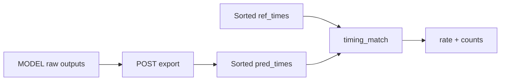

# Onset evaluation metrics

**Purpose:** Single reference for how StepCOVNet scores onset **timing** across AR, dense, and event tracks. Implementation: [`src/stepcovnet/timing_match.py`](../../src/stepcovnet/timing_match.py).

**Related:** [PIPELINE_ARCHITECTURE.md](PIPELINE_ARCHITECTURE.md) · [AR_ONSET_DESIGN.md](AR_ONSET_DESIGN.md) · [configs/README.md](../../configs/README.md) · [DISCUSSION_NOTES.md § NOTE-20260628-03](DISCUSSION_NOTES.md#note-20260628-03-tide-overfit-primary-metric--ordered-onset-match)

---

## Why ordered timing match

Chart onsets are an **ordered sequence in time**. A model that finds the right multiset of times but permutes two steps is wrong for chart reproduction and generation.

**Primary metric:** compare the `i`th earliest predicted onset to the `i`th earliest reference onset (after export and sort). No Hungarian reassignment.

**Auxiliary metric:** Hungarian event F1 still logs TP/FP/FN for legacy comparisons and multi-song val, but can hide per-rank timing errors (e.g. F1 **1.0** with **633/634** ordered @ 20 ms on tide).

---

## Definition — `timing_match`

Every track exports a **sorted** list of predicted onset times in seconds (`pred_times`) and compares to sorted reference times (`ref_times`).

| Symbol      | Meaning                                                                                |
| ----------- | -------------------------------------------------------------------------------------- |
| `n_ref`     | Number of reference onsets                                                             |
| `n_pred`    | Number of predicted onsets after POST (peak-pick, slot filter, AR decode, …)           |
| `n_matched` | Count of indices `i < min(n_pred, n_ref)` where `\|pred[i] − ref[i]\| ≤ tolerance_sec` |
| `n_denom`   | `max(n_pred, n_ref)`                                                                   |
| **rate**    | `n_matched / n_denom` (0 if `n_denom == 0`)                                            |

**Default tolerance:** `tolerance_sec = 0.02` (**20 ms**). Fixed across tracks for comparisons unless an experiment explicitly sweeps it.

### Examples (tide has `n_ref = 634`)

| Situation                             | `n_matched` | `n_pred` | `n_ref` | Rate    | Pass @ 1.0? |
| ------------------------------------- | ----------- | -------- | ------- | ------- | ----------- |
| All pairs within 20 ms, correct count | 634         | 634      | 634     | 1.0     | yes         |
| One pair off by >20 ms                | 633         | 634      | 634     | 633/634 | no          |
| First 634 perfect, **one extra** peak | 634         | 635      | 634     | 634/635 | no          |
| 619 correct prefixes, stopped early   | 619         | 619      | 634     | 619/634 | no          |

**Tide overfit pass bar:** rate **1.0** on teacher-fed and (for perfect-overfit / `gate-ar-decode`) free-run AR decode — equivalently **634/634** when `n_pred == n_ref == 634`.

### Micro aggregation (multi-song val)

Across songs, dense val reports:

```text
micro_timing_match = sum(n_matched) / max(sum(n_pred), sum(n_ref))
```

Per-song rates are also available in JSON (`timing_match_rate` per song); micro vs mean-per-song can diverge when song lengths differ.

---

## Pipeline: export then score



| Track             | POST export                                                                | Reference times                                |
| ----------------- | -------------------------------------------------------------------------- | ---------------------------------------------- |
| **AR (teacher)**  | Pointer+residual decode at masked onset steps                              | Teacher `target_times` at same steps           |
| **AR (free-run)** | Two-pass autoregressive decode → times                                     | Sorted GT from `gt_mask`                       |
| **Dense**         | Peak-pick on frame probs (`confidence_threshold`, `min_onset_distance_ms`) | Frame indices → seconds via hop                |
| **Event**         | Filter slots by confidence + min-gap → sort                                | `reference_times_from_mask(gt_times, gt_mask)` |

Order is **enforced at eval** by sorting both sides. AR decode is chronological by construction; dense/event rely on POST sort.

---

## Names by track

| Track           | Canonical name | Training / val log name             | Offline script                                       |
| --------------- | -------------- | ----------------------------------- | ---------------------------------------------------- |
| **AR**          | `timing_match` | `val_ordered_onset_match` (teacher) | `scripts/debug_ar_onset_overfit.py`                  |
| **AR free-run** | `timing_match` | `val_ar_decode_ordered_onset_match` | same + `--ar_decode`                                 |
| **Dense**       | `timing_match` | `val_timing_match` (callback)       | `scripts/eval_dense_onset.py` → `micro_timing_match` |
| **Event**       | `timing_match` | _(diagnostics only today)_          | `scripts/debug_onset_overfit.py`                     |

Backward-compatible JSON keys `ordered_onset_match` still appear in AR debug output alongside `timing_match`.

---

## Composite gates (AR overfit)

| Metric             | Formula                                            | Use                                    |
| ------------------ | -------------------------------------------------- | -------------------------------------- |
| `val_overfit_gate` | `min(val_token_accuracy, val_ordered_onset_match)` | Checkpoint on perfect-overfit configs  |
| Offline PASS       | `rate >= 1.0` (and `n_denom > 0`)                  | Human-readable stderr in debug scripts |

Free-run perfect-overfit also requires **`val_ar_decode_ordered_onset_match == 1.0`** (offline `--ar_decode`, two-pass timing). Token accuracy alone is insufficient.

---

## Auxiliary — Hungarian event F1

**Module:** `onset_events/matching.py`, `onset_events/metrics.py` (dense peak-pick reuses event counting).

| Setting        | Default                                      |
| -------------- | -------------------------------------------- |
| Matching       | Hungarian one-to-one, minimize total \|Δt\|  |
| Tolerance gate | Pair counts only if \|Δt\| ≤ `tolerance_sec` |
| Confidence     | TP requires `confidence ≥ threshold`         |

| Log name                 | Track                                   |
| ------------------------ | --------------------------------------- |
| `val_event_onset_f1`     | AR teacher, event training              |
| `val_ar_decode_event_f1` | AR free-run callback                    |
| `micro_event_f1`         | Dense val eval script                   |
| `event_onset_f1_mingap`  | Event path with 50 ms POST before match |

**When to use:** multi-song val scoreboard, detection vs timing decomposition (TP/FP/FN), historical EXP comparisons.

**When not to use as primary:** single-song tide overfit — ordered timing match is the pass/fail bar ([NOTE-20260628-03](DISCUSSION_NOTES.md#note-20260628-03-tide-overfit-primary-metric--ordered-onset-match)).

---

## Choosing a metric for an experiment

| Goal                                    | Primary                                    | Also log                                         |
| --------------------------------------- | ------------------------------------------ | ------------------------------------------------ |
| Tide / single-chart overfit             | `timing_match` rate **1.0**                | Hungarian F1, per-step ms errors, token acc (AR) |
| AR `gate-ar-decode`                     | Free-run `timing_match`                    | Teacher `timing_match`, decode length, EOS       |
| Multi-song dense val                    | `micro_timing_match` @ **fixed** threshold | `micro_event_f1`, TP/FP/FN                       |
| Event K-slot research (plateau ~30% F1) | `event_onset_f1` (still training default)  | `timing_match` in diagnostics when debugging     |

**Val model selection caveat:** `timing_match` on dense/event depends on POST (threshold, min-gap). Compare checkpoints only under the **same** export policy, or sweep threshold once and hold it fixed across runs.

**Train vs eval gap (event):** training loss still uses Hungarian L1 assignment on K slots; eval `timing_match` uses sorted export lists. That is acceptable for multi-song F1 research; for event overfit on one chart, consider ordered assignment (`assign_onset_pairs_ordered_numpy`) in a follow-up experiment.

---

## API quick reference

```python
from stepcovnet import timing_match

report = timing_match.timing_match_report(
    pred_times, ref_times, tolerance_sec=0.02,
)
# report: n_matched, n_pred, n_ref, n_denom, rate, tolerance_sec

rate = timing_match.timing_match_rate_numpy(pred_times, ref_times, tolerance_sec=0.02)

ref = timing_match.reference_times_from_mask(gt_times[0], gt_mask[0])
```

**Tests:** `tests/timing_match_test.py` · AR trainers: `tests/onset_ar/trainers_test.py` · dense: `tests/dense_overfit_eval_test.py`

---

## Changelog

| Date       | Change                                                                                                                                                                      |
| ---------- | --------------------------------------------------------------------------------------------------------------------------------------------------------------------------- |
| 2026-06-28 | Primary tide metric switched from Hungarian F1 to ordered match ([NOTE-20260628-03](DISCUSSION_NOTES.md#note-20260628-03-tide-overfit-primary-metric--ordered-onset-match)) |
| 2026-06-28 | Unified `timing_match.py` across AR / dense / event; rate denominator `max(n_pred, n_ref)` penalizes extra predictions                                                      |
