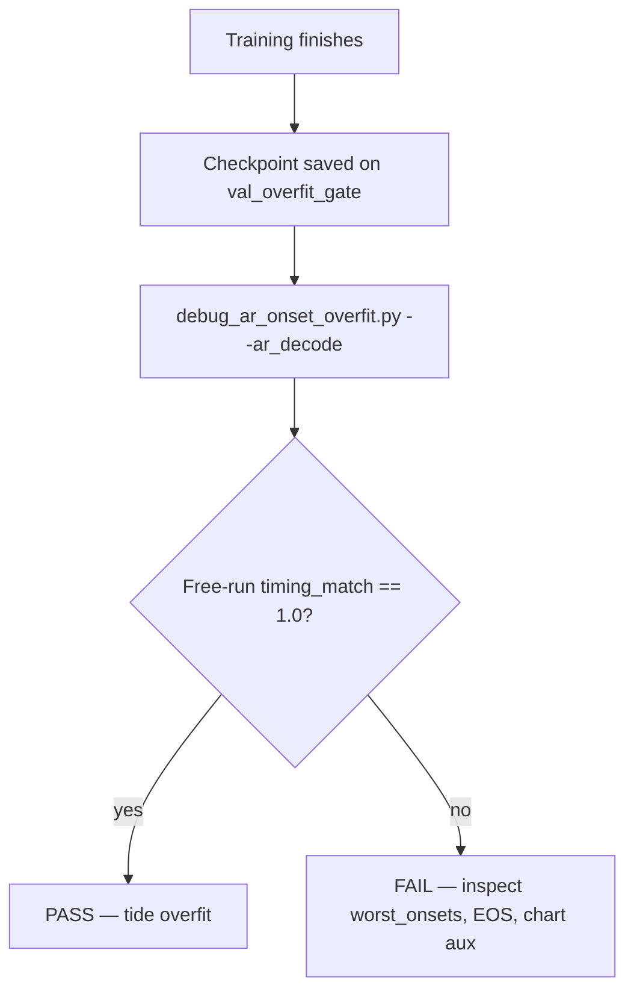

# Onset metrics during evaluation

**Purpose:** Metrics computed **after** training — offline scripts on saved checkpoints. These are the authoritative pass/fail scores for tide overfit and multi-song val.

**Training-time logs:** [ONSET_METRICS_TRAINING.md](ONSET_METRICS_TRAINING.md) · **Definitions:** [ONSET_METRICS.md](ONSET_METRICS.md)

---

## When to run evaluation

| Situation | Run |
| --------- | --- |
| AR tide overfit finished (or mid-run spot check) | `debug_ar_onset_overfit.py --ar_decode` |
| AR teacher-fed only (fast) | `debug_ar_onset_overfit.py` (no `--ar_decode`) |
| Dense model on val manifest | `eval_dense_onset.py` |
| Event model smoke | `eval_onset_event_f1.py` |
| Spectral-flux baseline | `eval_spectral_flux_onset.py` |

**Rule of thumb:** Training `val_overfit_gate` tells you whether to keep training. **Evaluation** tells you whether the checkpoint **passes**.

---

## Pass / fail bars

### AR tide overfit (634 onsets)

| Mode | Primary metric | Pass |
| ---- | -------------- | ---- |
| Teacher-fed | `ordered_onset_match` / `timing_match` vs **`target_times`** | **634/634** (rate **1.0**) |
| Free-run AR | `ar_decode.ordered_onset_match` vs **`target_times`** | **634/634** (rate **1.0**) |

Both are required for a full tide PASS. Free-run is stricter (autoregressive drift, EOS, wrong count).

### Dense multi-song val

| Primary | Pass bar (typical) |
| ------- | ------------------ |
| `micro_timing_match` | Experiment-specific; compare under fixed POST (threshold, min-gap) |

Also report `micro_event_f1` for detection-style comparison.

---

## AR onset — `debug_ar_onset_overfit.py`

```text
venv\Scripts\python.exe scripts/debug_ar_onset_overfit.py \
  --config configs/ar/tide_overfit.json \
  --model_path models_wsl/ar/tide_overfit/ar_onset_model.keras \
  --ar_decode
```

Dispatches to WSL GPU on Windows when needed. Human summary on **stderr**; full **JSON** on stdout.

### Critical

| JSON field | What it is | Pass |
| ---------- | ---------- | ---- |
| **`ordered_onset_match`** (top-level) | Teacher-fed `timing_match` vs `target_times` | `rate == 1.0`, `n_denom == 634` |
| **`ar_decode.ordered_onset_match`** (with `--ar_decode`) | Free-run two-pass `timing_match` vs `target_times` | `rate == 1.0`, `n_denom == 634` |

Each block includes: `n_matched`, `n_pred`, `n_ref`, `n_denom`, `rate`.

### Support

| JSON field | What it is |
| ---------- | ---------- |
| `chart_ordered_onset_match` | Ordered match vs raw chart `gt_times` (aux — hop quantization can differ from `target_times`) |
| `ar_decode.ar_decode_length` | Decoder steps taken |
| `ar_decode.stopped_on_eos` | Whether decode ended on EOS |
| `n_within_tolerance` | Per-step count within 20 ms (teacher report) |
| `n_patch_wrong` | Wrong patch index |
| `n_patch_ok_timing_wrong` | Patch correct, residual timing off |

### Debug / aux

| JSON field | What it is |
| ---------- | ---------- |
| `event_f1`, `true_positives`, `false_positives`, `false_negatives` | Hungarian F1 vs raw chart (teacher) |
| `ar_decode.event_f1` (+ TP/FP/FN) | Hungarian F1 on free-run times |
| `abs_error_ms`, `residual_error_ms` | p50 / p90 / p99 / max / mean timing error |
| `worst_onsets` | Largest-error steps (patch, residual, times) |
| `ar_decode.diagnostics` | With `--full-diagnostics`: token trace, gt_timing parity, incremental pointer, token detokenize |
| `eval_elapsed_sec` | Wall time |

### Flags

| Flag | Effect |
| ---- | ------ |
| `--ar_decode` | Run free-run gate (required for tide PASS) |
| `--full-diagnostics` | Slow extras under `ar_decode.diagnostics` |
| `--json-only` | Suppress stderr summary |
| `--worst_k N` | Number of worst onsets in JSON (default 20) |

### stderr sections

1. **Teacher-fed gate** — primary ordered match + aux chart + Hungarian
2. **Free-run AR gate** — decode length, EOS, ordered match + aux

---

## Dense onset — `eval_dense_onset.py`

Peak-picks frame probabilities, then scores exported onset **times** (not frames).

```text
venv\Scripts\python.exe scripts/eval_dense_onset.py --config <dense_config.json>
```

Default report path: `<model_output_dir>/eval_val_event_f1.json`.

### Critical

| JSON field | What it is | Decision use |
| ---------- | ---------- | ------------ |
| **`micro_timing_match`** | Micro-averaged ordered `timing_match` across val songs | Primary dense scoreboard |
| `timing_match_n_matched` / `timing_match_n_denom` | Numerator / denominator for micro rate | e.g. `4123/4500` |

### Support

| JSON field | What it is |
| ---------- | ---------- |
| `micro_event_f1` | Hungarian event F1 aggregated across val |
| `mean_event_f1` | Per-song F1 mean (can diverge from micro) |
| `micro_tp`, `micro_fp`, `micro_fn` | Detection decomposition |
| `micro_precision`, `micro_recall` | From micro counts |

### Debug

| JSON field | What it is |
| ---------- | ---------- |
| `per_sample` | Per-audio/chart metrics |
| `eval_kwargs` | Threshold, min-gap, tolerance used |
| `num_songs` | Val set size |

**Caveat:** Scores depend on POST (`confidence_threshold`, `min_onset_distance_ms`). Compare checkpoints only under the **same** export settings.

---

## Event onset — `eval_onset_event_f1.py`

Single-batch smoke on one chart (overfit mode). Prints raw and min-gap TP/FP/FN/F1 to stdout — not a full manifest eval.

### Critical (printed)

| Output | What it is |
| ------ | ---------- |
| `f1` (raw) | Hungarian event F1 @ tolerance, no min-gap |
| `f1` (mingap) | After `min_onset_distance_ms` POST |

Use for quick checkpoint sanity checks. Multi-song event val uses training `val_event_onset_f1` or a future manifest eval script.

---

## Spectral flux — `eval_spectral_flux_onset.py`

Baseline / diagnostic only. Reports `micro_event_f1` and per-threshold curves — not used for AR tide gates.

---

## Metric name map (training log → eval JSON)

| Concept | AR training log | AR eval JSON | Dense eval JSON |
| ------- | --------------- | ------------ | --------------- |
| Ordered timing match (teacher) | `val_ordered_onset_match` | `ordered_onset_match.rate` | — |
| Ordered timing match (free-run) | _(offline only)_ | `ar_decode.ordered_onset_match.rate` | — |
| Composite teacher gate | `val_overfit_gate` | `min(token_acc, ordered.rate)` if recomputed | — |
| Hungarian F1 | `val_event_onset_f1` | `event_f1` | `micro_event_f1` |
| Chart-time ordered match | — | `chart_ordered_onset_match.rate` | — |
| Micro timing (multi-song) | — | — | `micro_timing_match` |

Canonical implementation: [`src/stepcovnet/timing_match.py`](../../src/stepcovnet/timing_match.py).

---

## Evaluation workflow (AR tide)



1. Train; watch `val_overfit_gate` and loss terms.
2. Run offline eval with `--ar_decode`.
3. PASS only when **both** teacher and free-run ordered match are **634/634** vs `target_times`.
4. If close but failing, use `worst_onsets`, `n_patch_ok_timing_wrong`, and `chart_ordered_onset_match` to see whether the gap is residual, count, or chart quantization.

---

## Related

- [ONSET_METRICS_TRAINING.md](ONSET_METRICS_TRAINING.md)
- [ONSET_METRICS.md](ONSET_METRICS.md)
- [AR_ONSET_DESIGN.md](AR_ONSET_DESIGN.md)
