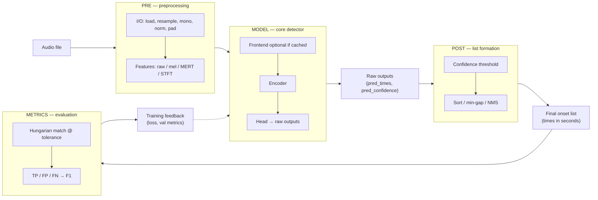

# Pipeline architecture — target structure

**Purpose:** North-star mental model for StepCOVNet onset detection. Implementation, tests, ablations, and the paper should align to this staged pipeline. Each stage is **swappable** where noted so we can isolate what failed or improved.

**Related:** [discussion notes](DISCUSSION_NOTES.md) · [experiment log](EXPERIMENT_LOG.md) · [paper outline](PAPER_OUTLINE.md) · [decisions checklist](DECISIONS_CHECKLIST.md) · [AR onset design](AR_ONSET_DESIGN.md) · [planning doc](../onset_output_targets_planning.md) · [tide shape walkthrough](TIDE_SHAPE_WALKTHROUGH.md)

**Origin:** Captured from design discussion [NOTE-20260606-10](DISCUSSION_NOTES.md#note-20260606-10-pipeline--pre-model-post-and-metrics); this file is the **canonical** architecture reference.

---

## End-to-end flow



ASCII equivalent:

```
audio
  → [PRE]     load, resample, mono, peak-norm, truncate/pad
              (+ optional features: raw waveform, log-mel, MERT, STFT-in-graph)
  → [MODEL]   frontend (if not pre-cached) → temporal encoder → head
              → raw outputs: K query slots OR dense frame probs OR AR token stream (+ pointer times)
  → [POST]    threshold / detokenize → sort → optional min-gap → sparse onset list
  → [METRICS] match predictions to GT (Hungarian @ tolerance) → TP/FP/FN → F1
  → training feedback (loss + val metrics) → updates MODEL (and optionally PRE if e2e)
```

---

## Stage definitions

### PRE — preprocessing

**Input:** audio file (`.ogg`, `.wav`, …)  
**Output:** tensor ready for the model — raw waveform **or** cached frame features

| Sub-stage    | Role                                                              | Swappable?                                                                    |
| ------------ | ----------------------------------------------------------------- | ----------------------------------------------------------------------------- |
| **I/O**      | Sample rate, mono, peak normalization, duration cap, pad/truncate | Rarely — shared contract across tracks                                        |
| **Features** | Representation fed to the core model                              | **Primary ablation axis** — raw Conv1D, cached mel, cached MERT, mel-in-graph |

**Ablation rule:** When comparing PRE variants, keep MODEL head, POST, and METRICS fixed.

---

### MODEL — core detector

**Input:** PRE output (+ optional `duration` for time scaling)  
**Output:** **raw** predictions before list filtering

| Track                      | Raw output                                    | Head style                              |
| -------------------------- | --------------------------------------------- | --------------------------------------- |
| **Event (`onset_events`)** | `pred_times` `(K,)`, `pred_confidence` `(K,)` | K query slots + cross-attention decoder |
| **Dense (baseline)**       | Per-frame onset probability vector            | U-Net / BiLSTM frame classifier         |
| **AR (`onset_ar`)**        | Token IDs + pointer/residual times per step   | Encoder–decoder seq2seq (**planned**)   |

**Swappable:** encoder depth/capacity, formulation (query slots vs dense vs AR tokens), token scheme, patch size, alignment (pointer vs free cross-attn). See [AR_ONSET_DESIGN.md §11](AR_ONSET_DESIGN.md#11-decision-registry) for locked AR slugs.

**Ablation rule:** When comparing MODEL variants, fix PRE and POST+METRICS where output formats allow.

---

### POST — raw outputs → final list

**Input:** raw model outputs  
**Output:** variable-length sorted onset times (seconds)

| Step      | Event path (inference)                   | AR path (inference)                          | Notes                                                                  |
| --------- | ---------------------------------------- | -------------------------------------------- | ---------------------------------------------------------------------- |
| Threshold | Keep slots with `confidence ≥ threshold` | N/A (ordered decode)                         | Default 0.5; cheap to sweep on a fixed checkpoint                      |
| Detokenize | N/A                                     | Pointer+residual → seconds per step          | Token LM cross-check in diagnostics                                    |
| Sort      | By time                                  | Already ordered                              |                                                                        |
| Min-gap   | Collapse predictions closer than ~50 ms  | **Off** for primary metric (`eval-min-gap`)  | Dense/event: optional `event_onset_f1_mingap`; AR primary eval without |

**Swappable:** confidence threshold, min-gap ms, optional NMS/dedup beyond min-gap.

**Ablation rule:** POST sweeps can run **without retraining** on saved checkpoints.

---

### METRICS — compare to ground truth

**Input:** predictions (raw K slots or post-filtered list) + chart GT times + mask  
**Output:** TP, FP, FN, precision, recall, F1

| Setting             | Default          | Role                                               |
| ------------------- | ---------------- | -------------------------------------------------- |
| Match tolerance     | 20 ms            | Valid pred–GT pair if \|Δt\| ≤ tolerance           |
| Matching            | Hungarian        | One-to-one, minimize total \|Δt\|                  |
| Confidence gate     | 0.5              | Matched pred counts as TP only if conf ≥ threshold |
| Min-gap metric path | 50 ms (optional) | `event_onset_f1_mingap` — post-filter before match |

**Swappable:** tolerance, threshold, matching algorithm (train vs eval alignment), whether min-gap is in the primary metric.

---

### Training feedback

**Input:** batch GT + model forward pass  
**Output:** scalar loss + logged val metrics that drive checkpointing

| Component       | Event path (current)                                     | AR path (planned)                          | Aligns with eval?                                   |
| --------------- | -------------------------------------------------------- | ------------------------------------------ | --------------------------------------------------- |
| Assignment      | Hungarian L1 on raw time error (`assign_onset_pairs_l1`) | Fixed order — no assignment                | AR: CE + optional aux time loss                      |
| Time loss       | L1 + L2 + beyond-tolerance penalty on matched pairs      | λ_time on \|t̂−t\| (`train-aux-time-loss`)   |                                                     |
| Confidence loss | BCE toward 1/0 from per-pair time error vs tolerance     | N/A (EOS token)                            |                                                     |
| Val metrics     | `event_onset_f1`, `event_onset_f1_mingap`                | Decoded event F1 (`train-checkpoint`)      | Dense: frame F1 in-train; event F1 post-hoc (A1)    |
| Exposure bias   | N/A                                                      | Scheduled sampling ramp (`gate-ar-decode`) |                                                     |

**Swappable:** `lambda_cls`, `lambda_time`, train assignment, confidence targets.

**Ablation rule:** Changing METRICS/train target without changing MODEL invalidates comparisons.

---

## Repo mapping (event path)

| Stage             | Module(s)                                                | Notes                                       |
| ----------------- | -------------------------------------------------------- | ------------------------------------------- |
| PRE I/O           | `onset_events/audio.py`                                  | librosa load, 44.1 kHz mono, peak norm      |
| PRE chart pairing | `pairing.py`, `dataset_prep/training_loader.py`, `dataset_prep/training_index.py` | `final_data` `.chart.json` + `chart_index`; `training_index.json` split; legacy `.txt` fallback |
| PRE features      | `onset_events/frontend.py`, `onset_events/preprocess.py` | Conv1d in-graph; mel/MERT `.npy` cache      |
| MODEL             | `onset_events/encoder.py`, `onset_events/models.py`      | U-Net encoder + query head                  |
| POST (inference)  | `onset_events/inference.py`                              | Threshold, sort, min-gap                    |
| METRICS           | `onset_events/matching.py`, `onset_events/metrics.py`    | Hungarian eval, F1, mingap path             |
| Training feedback | `onset_events/losses.py`, `onset_events/trainers.py`     | Combined loss, custom train/val steps       |
| Diagnostics       | `onset_events/diagnostics.py`                            | Confidence/assignment sweeps on checkpoints |

**Scripts:** `scripts/train_onset.py`, `scripts/train_onset_event.py`, `scripts/run_overfit_tide_suite.py`, `scripts/run_overfit_tide_ablations.py`

---

## Dense path (comparison baseline)

Same PRE/METRICS _idea_, different MODEL/POST shape:

```
audio → cached mel or MERT
     → U-Net frame classifier (per-hop probability)
     → peak pick + min distance on frame grid
     → event/frame F1 @ tolerance
```

Use dense MERT as the strongest in-repo baseline when judging whether event or AR formulations are worth the complexity.

---

## AR path (planned — [AR_ONSET_DESIGN.md](AR_ONSET_DESIGN.md))

**Status:** Design locked 2026-06; **not implemented**. Experiment gates: `gate-tide-overfit` → `gate-ar-decode` → `gate-10song-smoke` → `gate-val-vs-dense`.

```
audio → cached MERT on 10 ms hop grid
     → patch (P=8) + bidirectional encoder → memory (T′, d)
     → causal decoder → delta_bucketed tokens + pointer/residual times
     → autoregressive decode until <EOS>
     → event F1 @ tolerance (primary: no min-gap)
```

| Stage             | Module(s) (planned)                          | Notes                                                |
| ----------------- | -------------------------------------------- | ---------------------------------------------------- |
| PRE               | `ssl_features.py`, `dataset_prep/` loaders   | Same MERT hop grid as dense; reuse `training_index`  |
| MODEL             | `onset_ar/` (TBD)                            | Frozen MERT; pointer+residual + token LM             |
| POST              | Detokenize pointer times                     | Min-gap off for primary eval                         |
| METRICS           | `onset_events/matching.py`, `metrics.py`     | Same event F1 contract; sorted linear merge optional |
| Training feedback | Token CE + aux time; decoded F1 checkpoint   | Scheduled sampling after tide gate                   |

**Scripts (planned):** `scripts/train_onset_ar.py`, `configs/onset_ar_tide.json`, `configs/onset_ar_smoke.json`

---

## Ablation matrix (research protocol)

Tag each `EXP-…` entry with the stage under test:

| Tag      | Question example                                 |
| -------- | ------------------------------------------------ |
| `pre`    | Raw Conv1D vs mel vs MERT on same event head     |
| `model`  | K=2048 vs capacity; query slots vs dense vs AR tokens |
| `post`   | Threshold / min-gap sweep on fixed checkpoint    |
| `metric` | Train matching vs eval; mingap in primary metric |
| `train`  | Loss weights, epochs, LR                         |

**Do not co-vary two stages** in one experiment unless the hypothesis explicitly requires it.

---

## Paper alignment

When writing methods or results:

1. Describe the system using these five stages (PRE → MODEL → POST → METRICS → feedback).
2. State which stage each experiment varied (see ablation tags in [EXPERIMENT_LOG.md](EXPERIMENT_LOG.md)).
3. Separate **inference POST** from **metric POST** when they differ (e.g. min-gap in mingap metric only).

Update [PAPER_OUTLINE.md](PAPER_OUTLINE.md) incrementally when promoting findings for publication — see [research-session-workflow skill](../../.cursor/skills/research-session-workflow/SKILL.md). Experiment history stays in [EXPERIMENT_LOG.md](EXPERIMENT_LOG.md).

---

## Open design questions

| Question | Status |
| -------- | ------ |
| PRE in cache vs in Keras graph (e2e learnability vs speed)? | **open** (B2) |
| Primary val metric: inference POST (min-gap) vs raw slots? | **decided** for AR primary (`eval-min-gap` off); dense/event report both paths (A4) |
| Single config schema `{pre, model, post, metric}` for all ablations? | **open** |
| K-query formulation ceiling on tide? | **decided** — ~30% plateau; oracle ~31% (EXP-20260606-11); not a wiring bug |
| AR vs dense on `final_data` val? | **open** — run `gate-val-vs-dense` after AR gates pass |
| Downstream generator ship path (dense vs AR times)? | **open** (`ship-path` / F3) |

Track slugs and gates in [DECISIONS_CHECKLIST.md](DECISIONS_CHECKLIST.md) § C and [AR_ONSET_DESIGN.md §11](AR_ONSET_DESIGN.md#11-decision-registry).
